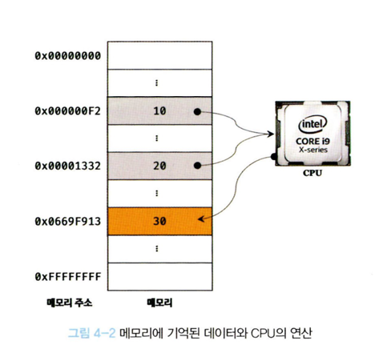
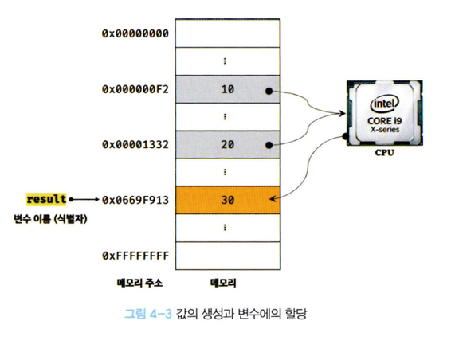
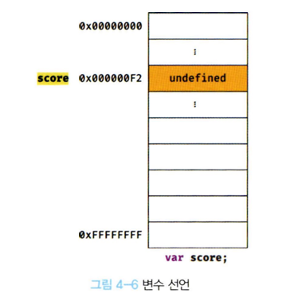
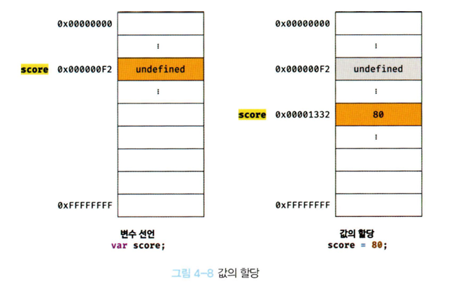
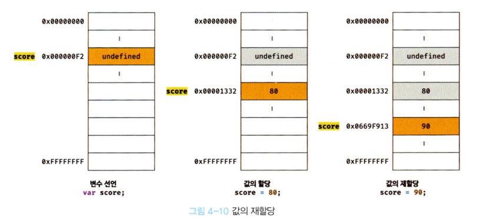
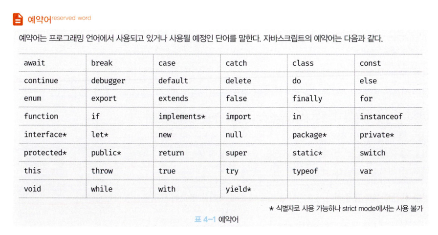

# 04장 변수

컴퓨터는 사람을 모델로 디자인 되었기 때문에 사람과 유사하게 동작합니다.

```
10 + 20
```

---

위 식에 대해서 계산을 진행할 때 사람과, 컴퓨터가 어떤식으로 다른지 살펴봅시다.

> 사람

- 사람은 10, 20, + 라는 기호에 대한 의미를 알고 있어야 합니다.
- 10 + 20 이라는 식이 의미도 해석할 수 있어야 합니다.
  - `10`과 `20`을 `숫자`로, `+` 를 `덧셈` 이라는 `기호`로 기억합니다.
- 계산식에 대한 결과로 나올 30 도 기억해야 합니다.

> 컴퓨터

- `10`, `20`이라는 `리터럴`과 `+`라는 `연산자`의 의미를 알고 있어야 합니다.
- 10 + 20 이라는 식(표현식)의 의미도 해석할 수 있어야 합니다.

---

여기서 이제 차이점이 조금 나타납니다.

```
사람은 `두뇌`에서 연산과 기억에 대한 처리를 진행합니다

하지만 컴퓨터는 `연산`과 `기억`을 각각 `CPU`와 `메모리`에서 진행합니다.
```

> 메모리

메모리는 데이터를 저장할 수 있는 메모리 셀의 집합체를 의미합니다. 1바이트(8비트)의 하나 셀 단위로 데이터를 저장하거나 읽습니다.

- 각 셀에는 고유한 메모리 주소가 있습니다. 메모리 주소는 각 공간의 위치를 의미합니다.

---

다시 돌아와서 컴퓨터가 10 과 20에 대한 값을 연산할 때, 이 메모리에 저장된 값을 읽어 연산을 수행합니다. 그리고 계산 결과로 나온 30도 메모리 주소 어딘가에 저장합니다.

_여기서 문제가 발생합니다._

30 이라는 결과값을 메모리에 저장은 했지만 다시 불러와 재사용할 순 없습니다. 단 한번만 사용하면 문제가 없겠지만 다시 재사용하기 위해서는 30이 저장된 메모리 공간에 직접 접근해야 합니다.

하지만 이런 행위는 치명적인 오류를 발생시킬 가능성이 높습니다.

> 예를들어, 프로그램을 실행하기 위해 만들어둔 베이스 코드의 메모리를 건들여 프로그램이 죽어버리는 일
> 또한, 직접 메모리 접근이 가능하다고 해도, 메모리 상황에 따라 임의로 주소가 결정되기 때문에 메모리 주소를 통한 접근법은 적절하지 않습니다.



### 변수의 탄생

그래서 탄생한 것이 바로 변수 입니다.

- 변수는 하나의 값을 저장하기 위해 메모리 공간 자체 또는 그 메모리 공간을 식별하기 위해 붙인 이름(별명)을 의미합니다.

다시 뒤로 돌아가서 10 + 20계산을 변수를 통해 작성할 수 있습니다.

```
var sum = 10 + 20;
```

이로서 CPU를 통해 계산된 결과같이 동일하게 메모리 공간에 저장되지만, 변수를 통해 메모리 공간에 상징적인 이름을 붙여 재사용 할 수 있습니다.



---

### 키워드

> 변수명(변수 이름, 식별자)

메모리 공간에 저장된 값을 식별할 수 있는 고유한 이름

> 변수 값

변수에 저장된 값 (메모리 공간에 실제로 존재하는 값)

> 할당 (대입, 저장)

변수 값을 저장

> 참조

변수 값을 읽어 들이는 것

## 식별자 및 선언

메모리 상에 존재하는 값을 식별할 수 있는 이름을 모두 `식별자`라 부릅니다. 그리고 자바스크립트 엔진에 이런 식별자에 대한 존재를 알리기 위해 `선언`을 해야합니다.

> 선언

변수의 선언을 통해서 변수가 할당되기 전, 메모리 공간을 확보해 값을 저장할 수 있는 준비를 하는 단계입니다. 변수 선언에 의해 확보된 공간은 확보가 해제되기 전 까지 메모리 공간을 사용할 수 없도록 보호합니다.

변수 선언에 사용되는 키워드는 다음과 같습니다.

`var` `let` `const`

다들 잘 알고 있고, 너무나도 많이 사용되는 키워드 들이죠.

```js
var score;
```



변수 선언문을 통해서 다음과 같이 메모리 공간을 확보하고 `undefined`라는 값을 자동으로 할당되어 초기화 됩니다.

> undefined

undefined는 javascript에서 제공하는 원시 타입의 값입니다.

이렇게 변수의 선언은 2단계로 진행됩니다.

- 선언 단계
- 초기화 단계

---

만약 초기화 단계를 거치지 않는다면, 해당 메모리 공간을 이전에 다른 어플리케이션에서 사용했던 값이 남아있을 수 있습니다. 이러한 값을 `쓰레기 값(garbage value)`라 부릅니다.

값이 할당하지 않는 상태에서 변수를 참조하면 쓰레기값이 나올 수 있습니다.

> ReferenceError

변수를 사용하려면 반드시 선언이 필요합니다. 선언하지 않은 변수를 참조하게 되면 `ReferenceError(참조에러)`가 발생합니다.

## 4.4 실행 시점과 호이스팅

변수의 시점은 `런타임 이전`과 `런타임`으로 구분할 수 있습니다.

> 런타임 이전

런타임 이전에는 소스코드의 평과 과정을 거치는데 이때, 변수 선언을 포함한 모든 선언문을 소스코드에서 찾아 먼저 실행시킵니다.

> 런타임

선언문을 제외하고 소스코드를 한 줄씩 순차처리합니다.

그래서 다음과 같은 코드에서도 `referenceError`가 나타나지 않는 것이죠

```
console.log(score); //undefined

var score;
```

이러한 자바스크립트의 특징을 호이스팅 이라고 합니다.

변수 뿐 아니라

`var` `let` `const` `function` `class` 키워드는 모두 호이스팅 됩니다.

## 4.5 변수의 할당

변수의 선언은 `런타임 이전`에 수행되지만 변수의 할당은 `런타임`에 실행됩니다.

그렇기 때문에 다음 코드는 다음과 같이 동작합니다.

```js
console.log(score); //undefined

var score; // 변수 선언
score = 80; // 변수 할당

console.log(score); //80
```



여기서 주의할 점은, 선언과 동시에 초기화 되면서 차지하고 있던 `undefined`자리에 `80`이 할당되는게 아닌, 새로운 메모리 공간을 확보해 `80`을 저장합니다.

```js
console.log(score); //undefined

score = 80; // 변수 할당
var score; // 변수 선언

console.log(score); //80
```

코드상으로 선언 이전에 할당이 된다고 해도 선언은 `런타임 이전`에 수행되기 때문에 위 이전 코드와 동일하게 동작합니다.

## 4.6 값의 재할당

```js
var score = 80; //변수 선언과 값의 할당(흔히 초기화라 부름)
score = 90;
```



이제 사용하고 있지 않은 불필요한 값들은 가비지 콜렉터를 통해 메모리에서 자동 해제됩니다.
그래서 이 기간동안, 초기화되지 않은 값을 사용하면 이런 값들이 나올 수 있습니다.

## 4.7 식별자 네이밍 규칙

- 특수문자를 제외한 문자, 숫자, 언더스코어, 달러기호를 포함할 수 있다.
- 단 식별자는 특수문자를 제외한 문자, 언더스코어, 달러기호로 시작 가능, 숫자는 허요하지 않는다.
- 예약어는 식별자로 사용할 수 없다.
  

---

> 쉽표로 구분해 선언 가능

```js
var person, name, val1;
```

> 유니코드 문자 허용 하지만 권장하지 않음

```js
var 변수임;
```

> 사용 불가

```js
var first-name; // - 못씀
var 1st; //숫자가 첫 번째로 들감
var this; //예약어
```

> 대소문자 구분

```js
var firstname;
var firstName;
var FIRSTNAME;
```

다 다른 변수임

> 네이밍 컨벤션

```js
//카멜 케이스
var firstName;

//스네이크 케이스
var first_name;

//파스칼 케이스
var FirstName;

// 헝가리언 케이스
var strFirstName; //type + identifier
var $ele = document.getElementById("uid"); // DOM 노드
var observable$ = fromEvent(document, "click"); // RxJS 옵저버블
```

> RxJS 옵저버블

시간이 지남에 따라 여러 개의 값을 전달할 수 있는 데이터 스트림

---

특징

- 시간 기반 데이터 처리
  - 배열: 모든 데이터를 한 번에 제공
  - Observable: 데이터를 시간에 따라 차례로 전달
- 지연실행
  - 구독하기 전에는 실행하지 않음
- 무한 데이터
  - 스트림을 무한히 이어갈 수 있음
- 취소 가능
  - `unsubscribe()`로 중간에 그만 받을 수 있음.

---

예시

- 버튼 클릭 이벤트 감지
- API 폴링(polling)
- 실시간 채팅 메시지 수신
- 주식 시세 스트리밍
- 애니메이션 프레임 처리
