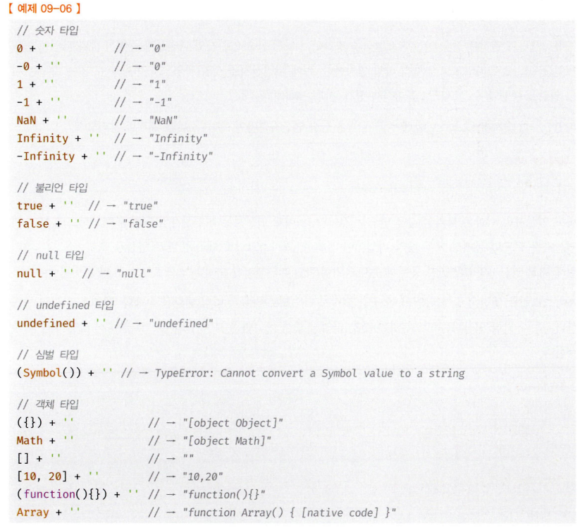
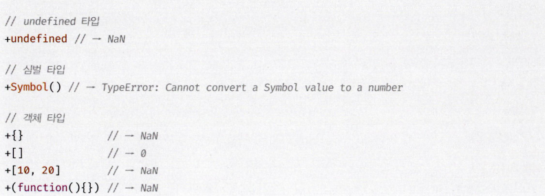

# 09장 타입변환과 단축평가

## 9.1 타입 변환이란?

타입 변환에는 두 종류가 존재한다.

1. 개발자의 의도에 따라 타입을 변환하는 **명시적 타입 변환(타입 캐스팅)**
2. 개발자의 의도와 상관없이 평가 도중 js 엔진에 의해 자동으로 타입이 변환되는 **암묵적 타입 변환(타입 강제 변환)**

### 명시적 타입 변환

```tsx
var x = 10;
// 명시적 타입 변환
// 숫자를 문자열로 타입 캐스팅한다.
var str = x.toString();
console.log(typeof str, str); // string 10
// x 변수의 값이 변경된 것은 아니다.
console.log(typeof x, x); // number 10
```

### 암묵적 타입 변환

```tsx
var x = 10;
// 암묵적 타입 변환
// 문자열 연결 연산자는 숫자 타입 x의 값을 바탕으로 새로운 문자열을 생성한다.
var str = x + '';
console.log(typeof str, str); // string 10
// x 변수의 값이 변경된 것은 아니다.
console.log(typeof x, x); // number 10
```

두 예제 모두 기존 원시 값인 `x(10)` 의 값을 직접 변경하는것은 아니다.
메모리 관점에서는 `'10'` 값을 사용하기위해 임시적으로 저장하는 것

### 명시적 vs 암묵적

**명시적 타입 변환**은 개발자가 타입을 변경하겠다는 의지가 명백히 드러난다.

**암묵적 타입 변환**의 경우에는 눈에 확 띄지 않기 때문에 타입이 어떻게 변환 될 것인지 예측 가능해야 하며 예측이 결과와 일치하지 않으면 오류가 날 수 있다.

그렇다면 **명시적 타입 변환** >>> **암묵적 타입 변환** 인 것인가?
꼭 그렇진 않다 js를 잘 아는 개발자라면 **암묵적 타입 변환**이 **명시적 타입 변환**보다 가독성이 더 좋다고 느낄 수 있다.

```ts
//명시적 타입 변환
(10).toString();

//암묵적 타입 변환
10 + '';
```

(이 부분은 개인적으로 좀 아닌것같음 명시적 부분이 코드 살짝 긴것 빼고는 가독성이 더 좋은듯)

결론적으로는 해당 챕터를 알아야하는 이유는 본인, 동료가 작성한 코드를 잘 이해하는게 핵심이고 그러기 위해선 타입 변환이 어떻게 작동하는지 꼭 이해하고 넘어가야 한다!

## 문자열 타입 변환

### 암묵적 타입 변환

```ts
// 피연산자가 모두 문자열 타입이어야 하는 문맥
'10' + 2 // -> '102'
// 피연산자가 모두 숫자 타입이어야 하는 문맥
5'10' // -> 50
// 피연산자 또는 표현식이 불리언 타입이어야 하는 문맥
!0//-> true
if (1) { }
```

`+` 연산자의 특성상 문자열 + 원시 타입(숫자, 불리언, 심볼 등) 의 형식이 되면 자동으로 문자열이 아닌 원시타입의 타입을 자동으로 문자열로 변환시킨다.

꼭 피연산자만 타입 변환의 대상이 되는것은 아니다. 표현식도 평가의 대상이 될 수 있다.
(표현식: 값을 만들어내는 코드 조각)

```ts
const num = 10 + 1; // O
const add = function (a, b) {
  // O
  return a + b;
};
```

예시로 탬플릿 리터럴 ` `` ` 내부의 표현식 결과를 암묵적으로 변환한다.

```ts
1+1 = ${1 + 1}` // - "1 + 1 = 2"
```

### 명시적 타입 변환

1. String 생성자 함수를 new 연산자 없이 호출하는 방법

```ts
String(1);
```

2. `Object.prototype.toString` 메서드를 사용하는 방법

```ts
(1).toString();
```

3. 문자열 연결 연산자를 이용하는 방법

```ts
1 + '';
```

### 기타 타입 문자열로 변환 자료



## 숫자 타입으로 변환

### 암묵적 타입 변환

```ts
1 - '1'; // 0
1 * '10'; //10
1 / 'one'; // NaN
```

js엔진은 산술 연산자를 만나면 숫자타입이 아닌 값을 숫자타입으로 변환한다.
이때 변환이 불가능한 경우에 `NaN`이 된다.

```ts
'1' > 0; // - true
```

숫자로 변환시키는 연산자는 산술연산 뿐 아니라 비교연산도 해당된다.

js엔진은 숫자가 아닌 값을 숫자로 **암묵적 타입 변환** 을 시킬 때 다음과 같이 작동한다.

```ts
+''; // 0
+'0'; //0
+'abcdbad'; // NaN
+true; //1
```

### 명시적 타입 변환

1.  Number 생성자 함수를 new 연산자 없이 호출하는 방법

```ts
Number('0'); //0
```

2.  parseInt, parseFloat 함수를 사용하는 방법(문자열만 숫자 타입으로 변환 가능)

```ts
parseInt('0'); //0;
```

3.  `+` 단항 산술 연산자를 이용하는 방법

```ts
+'0'; //0
```

4.  `*` 산술 연산자를 이용하는 방법

```ts
'0' * 1; //0
```

### 기타 타입 숫자로 변환 자료



## 불리언 타입 변환

### 암묵적 타입 변환

`if`, `for`문과 같은 제어문 등등은 조건식을 불리언 값(true or false)로 평가하기 때문에 조건의 결과를 암묵적으로 불리언 값으로 변환한다.

불리언 타입이 아닌 값을 **Truthy 값(참으로 평가되는 값)** 또는 **Falsy 값(거짓으
로 평가되는 값)** 으로 구분한다.

```ts
//falsy 값
false
undefined
null
0.-0
NaN
''(빈 문자열)
```

이 외에는 전부 **Truthy** 한 값으로 평가되는 요소들이다.

### 명시적 타입 변환

1. Boolean 생성자 함수를 new 연산자 없이 호출하는 방법

```ts
Boolean('x'); // true
```

2. 부정 논리 연산자를 두 번 사용하는 방법

```ts
!!'x'; // true
```

## 단축 평가

논리 연산자 `||(or)`또는 `&&(and)` 표현식의 평가 결과는 불리언 값이 아닐 수 있다.
`||(or)`또는 `&&(and)` 표현식은 꼭 모든 피연산자를 평가하지 않을 수 있다.

```ts
'Cat' && 'Dog'; // - "Dog"
```

`&&(and)`는 두 피연산자 모두 `true`일 때 `true`를 반환한다.

첫 번째 피연산자 `'Cat'`은 `Truthy` 값이므로 `true`로 평가된다.

하지만 여기서 아직 평가를 종료할 수 없다.

두 번째 피연산자가 `&&(and)`의 평가 결과를 결정한다.

이때 `&&(and)`는 이를 결정하는 두 번째 피연산자 `'Dog'`를 그대로 반환한다.

`||`연산자도 동일하게 작동한다.

```ts
'Cat' || 'Dog'; // - "Cat"
```

첫 번째 피연산자 `'Cat'`은 `Truthy` 값이므로 `true`로 평가된다.

`||`연산의 특성상 두 번째 피연산자는 확인하지 않아도 표현식을 평가 가능하다.

이때 `&&`와 마찬가지로 논리 연산의 값을 결정한 피연산자를 그대로 반환한다.

이를 **단축 평가short-circuit evaluation**라 한다.

단축 평가는 표현식을 평가하는 도중에 평가
결과가 확정된 경우 나머지 평가 과정을 생략하는 것을 말한다.

### 단축 평가 응용하기

```ts
var elem = null;
var value = elem.value; // TypeError: Cannot read property 'value' of nul1
```

```ts
var elem = null;
// elemo null이나 undefined와 같은 Falsy 값이면 elem으로 평가되고
// elemo Truthy 값이면 elem.value로 평가된다.
var value = elem && elem.value; //- null
```

객체가 아닌 null같은 값일 경우 참조 에러가 발생한다. 이를 단축 평가를 응용해서 에러를 방지 가능하다.

## 기타 연산자 모음

### 옵셔널 체이닝 연산자

```ts
// elemo null 또는 undefined이면 undefined를 반환하고, 그렇지 않으면 우항의 프로퍼티 참조를 이어간다.
var value = elem?.value;
console.log(value); // undefined
```

`&&`로 안전하게 접근했을때와 `&&` 연산자는 단축 평가로 인해 좌항이 `Falsy`한 값이라면
그 즉시 평가를 종료하고 좌항을 반환하지만

옵셔널 체이닝 연산자는 좌항이 `null` or `undefined`일때만 좌항을 반환하고 그 외의 경우(빈 문자열등등) 의 경우에는 참조를 이어간다.

```ts
var length = str?.length;
console.log(length); //0
```

### null 병합 연산자

`??` 는 좌항의 피연산자가 `null` 또는
`undefined` 인 경우 우항의 피연산자를 반환하고, 그렇지 않으면 좌항의 피연산자를 반환한다.

```ts
var foo = '' || 'default string';
console.log(foo); // "default string"
```

기본값 `''`가 유효한 경유 위 코드는 의도하지 않은 동작을 할 수 있다.

```ts
var foo = '' ?? 'default string';
console.log(foo); // ''
```

null 병합 연산자를 쓰면 `null` 또는
`undefined` 인 경우에만 좌항이 반환되기에 이런 경우 응용 가능하다.
