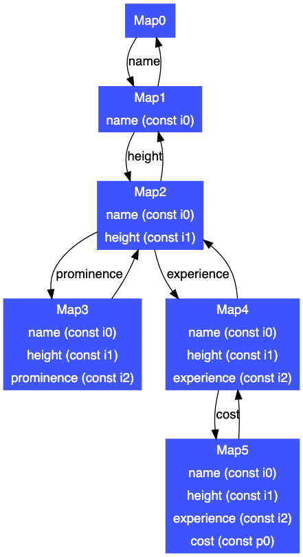
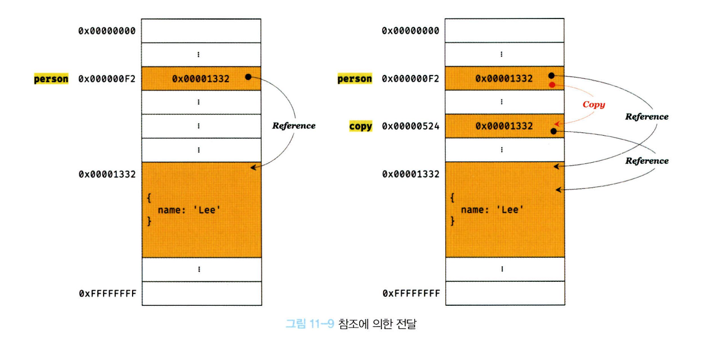

# 원시 값과 객체의 비교

## 원시 값

- 원시 타입의 값, 즉 원시 값은 변경이 불가능한 값이다. (읽기전용)

변수와 구분점

값은 변수에 저장된 데이터로서 표현식이 평가되어 생성된 결과를 말한다.

변경 불가능한 것은 변수가 아니라 값에 대한 진술이다.

> "원시 값은 변경 불가능하다"는 원시 값 자체를 변경할 수 없다는 것이지, 변수 값을 변경할 수 없다는 것은 아니다. 

- 변수는 언제든지 재 할당(엄밀히 말하자면 교체)할 수 있다.

이전 변수파트를 읽으면서 변수가 재할당 될 때, 메모리 주소가 바뀌어져서 들어간다는 사실을 알고 있다.

그 이유가 여기서 나오는데, 각각에 메모리에 할당된 값은 원시 값은 불편하기 때문에, 새로운 메모리를 할당해서 변수에 원시 값을 새롭게 넣어주는 것이다

값의 이러한 특성을 "불변성"이라고 한다.

## 문자열과 불변성

위에서 설명한 불변성의 특징 덕분에 자바스크립트에서는 독특한 특징의 문자열을 사용할 수 있습니다. 

C와 java를 봤을 때, 배열로 문자열을 표현하거나, String객체를 통해서 문자열을 표현합니다.

하지만 자바스크립트에서는 string을 하나의 원시 타입으로 제공합니다. 그렇기 때문에 "불변성"의 특징또한 가지고 있죠,

```js
var str = "Hello";
str = "World";
```

위에서 설명했던 변수의 특징과 동일하게, Hello라는 메모리 주소는 불변성에 의해서 World라는 메로리 주소로 바라보게 바뀝니다.

```js
var str = "string";

str[0] = "S";

console.log(str) // string
```

불변성이란 특성 덕분에 유사 배열 형태를 띄고있는 문자열 타입은 중간 값을 변경해도 값이 변경되지 않습니다.

## 자바스크립트의 객체 관리 방식

자바스크립트에서는 객체를 관리하는데 있어서 단순한 동적으로 프로퍼티와 메서드를 추가할 수 있도록 사용한다면, 사용하기는 매우 편리하겠지만 C에서 제공하는 객체(인스턴스)보다 비용이 더 많이 드는 비효율적인 방식으로 동작할 것 입니다.

따라서 V8 자바스크립트 엔진에서는 프로퍼티 접근을 위해 "동적 탐색" 대신 "히든 클래스"라는 방식을 사용해 객체를 관리합니다.

### 히튼 클래스

히든클래스를 한 문장으로 정의하자면,

> 로퍼티가 바뀔 때 각각 그 프로퍼티의 오프셋을 업데이트한 뒤 그 값을 가지고 있는 방식입니다.



그림을 보면서 설명을 좀 드리자면, 

- 객체는 반드시 하나의 히든 클래스를 참조합니다.
- 히든 클래스는 각 프로퍼티에 대해 메모리 오프셋을 가지고 있습니다.
- 동적으로 새로운 프로퍼티가 만들어질 때, 혹은 기존 프로퍼티가 삭제되거나 기존 프로퍼티의 데이터 타입이 바뀔 때는 신규 히든 클래스가 생성되며, 신규 히든 클래스는 기존 프로퍼티에 대한 정보를 유지하면서 추가적으로 새 프로퍼티의 오프셋을 가지게 됩니다.
- 히든 클래스는 프로퍼티에 대해 변경이 발생했을 때 참조해야 하는 히든 클래스에 대한 정보를 갖습니다.
- 객체에 새로운 프로퍼티가 만들어지면, 현재 참조하고 있는 히든 클래스의 전환 정보를 확인한 후, 현재 프로퍼티에 대한 변경이 전환 정보의 조건과 일치하면, 객체의 참조 히든 클래스를 조건에 명시된 히든 클래스로 변경시킵니다.

위 와 같은 방식으로 객체의 프로퍼티를 참조해 사용하기 때문에 동적 탐색으로부터 회피하고 속도 저하를 막을 수 있습니다.

히든 클래스 내부적으로는 인라인캐싱을 지원해 최적화 시킨다고 합니다.

---



위와 같은 특성 덕분에, 객체는 원시 타입으로서 메모리에 값을 재할당 해야하는 것이 아닌, 객체를 직접 변경할 수 있게 되었습니다.

물론 장점만 있는 것은 아닌데, 이러한 특징으로 인해서

> 여러 개의 식별자가 하나의 객체를 공유할 수 있다.

는 구조적인 단점도 존재합니다.

## 얕은 복사, 깊은 복사

- 얕은 복사: 한 단계 까지만 복사하는 것
- 깊은 복사: 중첩되어 있는 객체까지 모두 복사

얕은 복사화 깊은 복사로 생성된 객체는 원본과 다른 객체다. 

---

> 이 부분에 대해서 문득 궁금해진 점이 있습니다.

React에서 컴포넌트간 상태를 넘길 때 porps를 사용하는데, 이 props의 값이 객체 혹은 배열이라면, ...(스프레드 문법)을 사용해서 얕은 복사로 값을 넘기게 됩니다.

여기서 의문은 얕은 복사와 깊은 복사 두 가지 모두 원본과는 다른 객체를 생성하는것이고, 이왕이면 원본 값처럼 사용할 수 있는 깊은 복사가 좋지 않을까? 라는 생각을 하게 되었습니다.

결론부터 말씀드리면, 얕은 복사는 
- react에서 추구하는 불변성과 잘 어울린 다는 것
- 깊은 복사는 상태가 변경될 때 마다 재귀적으로 매번 복사가 필요하기 때문에 렌더링 성능에서 좋지 않은 효율을 낼 수 있다는 것

### 번외(react의 불변성과 얕은 복사)

React는 props/state를 불변성 기반으로 관리합니다.

새로운 참조(얕은 복사)만 만들어주면, React는 "이전 객체와 참조가 달라졌다 → 값이 바뀌었다"고 판단 가능한 것이죠

내부 구조까지 비교할 필요가 없어지기 때문에 성능적으로도 우수합니다. 
