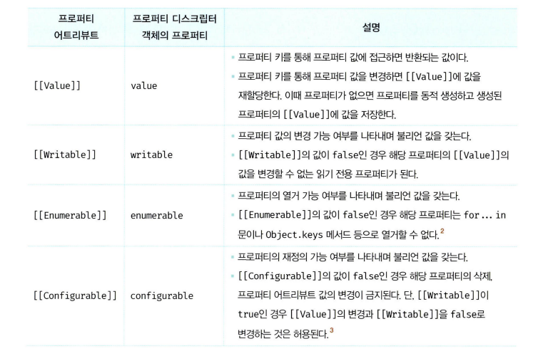
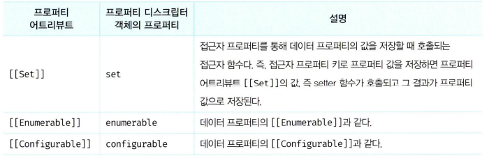
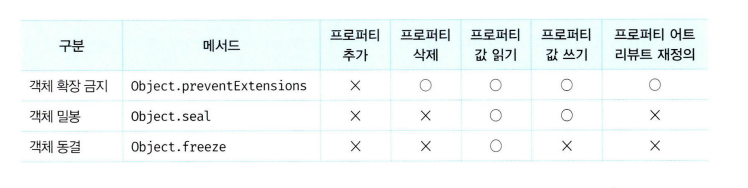

# 16장 프로퍼티 어트리뷰트

## 16.1 내부 슬롯과 내부 메서드

내부 슬롯과 내부 메서드는 자바스크립트 엔진의 내부 로직이다.
그렇기 때문에 개발자가 직접 접근할 수 없다.

일부 내부 슬롯, 내부 메서드는 접근 가능한데

예시로 모든 객체는 `[[prototype]]` 이라는 내부 슬롯을 갖는다.

원래는 내부 로직이기때문에 접근할 수 없지만 위의 경우는

```ts
const o = {};
o.[[Prototype]] // - Uncaught SyntaxError: Unexpected token.]
o.__proto__ // - Object.prototype

```

를 통해서 접근할 수 있다.

### 내부 슬롯 , 내부 메서드 예시

```ts
const obj = { name: '구도윤' };
//엔진에서는
//[[Value]] <-요 내부 슬롯에 '구도윤' 등록
obj.name;

//[[Get]] 내부 메서드를 실행하여 반환
```

## 16.2 프로퍼티 어트리뷰트와 프로퍼티 디스크립터 객체

자바스크립트 엔진은 프로퍼티를 생성할 때

프로퍼티의 상태를 나타내는 프로퍼티 어트리뷰트를 기본값으로
자동 정의한다.

즉 내부 슬롯 `[[Value]]`,`[[Writable]].`,` [[Enumerable]]`,`[[Configurable]]` 이런거를 자동으로 만들어준다는 뜻

이런건 내부 로직에 쓰기때문에 접근 불가능하지만

` Object.getownPropertyDescriptor`메서드를 통해 확인가능

```ts
const person = {
  name: 'Lee',
};

// 프로퍼티 어트리뷰트 정보를 제공하는 프로퍼티 디스크립터 객체를 반환한다.
console.log(Object.getOwnPropertyDescriptor(person, 'name'));
// {value: "Lee", writable: true, enumerable: true, configurable: true}
```

`getOwnPropertyDescriptors`메서드는 모든 프로퍼티 어트리뷰트 반환

```ts
console.log(Object.getOwnPropertyDescriptors(person));
/*
{
   name: {value: "Lee", writable: true, enumerable: true, configurable: true},
   age: {value: 20, writable: true, enumerable: true, configurable: true}
}
*/
```

## 16.3 데이터 프로퍼티와 접근자 프로퍼티

프로퍼티는 두가지로 나뉜다.

1. 데이터 프로퍼티
2. 접근자 프로퍼티

### 데이터 프로퍼티

`{ name: 'doyoon' }` 이런식의 늘 쓰던 프로퍼티를 말함



### 접근자 프로퍼티

값이 아닌 프로퍼티를 읽거나 쓰는 **접근자 함수** 가 포함된 프로퍼티를 의미한다.




```ts
const person = {
  // 데이터 프로퍼티
  firstName: 'Ungmo',
  lastName: 'Lee',

  // fullName은 접근자 프로퍼티
  // getter
  get fullName() {
    return `${this.firstName} ${this.lastName}`;
  },

  // setter
  set fullName(name) {
    // "Heegun Lee" → ["Heegun", "Lee"]
    [this.firstName, this.lastName] = name.split(' ');
  },
};

// 1. 데이터 프로퍼티 직접 접근
console.log(person.firstName, person.lastName);
// "Ungmo Lee"

// 2. 접근자 프로퍼티 (getter) 사용
console.log(person.fullName);
// getter 실행 → "Ungmo Lee"

// 3. 접근자 프로퍼티 (setter) 사용
person.fullName = 'Heegun Kim';
// setter 실행 → firstName = "Heegun", lastName = "Kim"

// 4. 다시 getter로 확인
console.log(person.fullName);
// "Heegun Kim"
console.log(person);
// { firstName: "Heegun", lastName: "Kim" }
```

프로퍼티 이름 앞에 `get`, `set` 붙으면 이것들이 바로 `getter`, `setter` 접근자 프로퍼티이다.

이것들은 `[[Value]]`을 가지지 않으며

1. 프로퍼티 키가 유효한지 확인한다. 프로퍼티 키는 문자열 또는 심벌이어야 한다. 프로퍼티 키 "fullName"은 문자열이므로 유효
   한 프로퍼티 키다.

2. 프로토타입 체인에서 프로퍼티를 검색한다. person 객체에 fullName 프로퍼티가 존재한다.

3. 검색된 fullName 프로퍼티가 데이터 프로퍼티인지 접근자 프로퍼티인지 확인한다. fullName 프로퍼티는 접근자 프로퍼티다.

4. 접근자 프로퍼티 fullName의 프로퍼티 어트리뷰트 [[Get]]의 값, 즉 getter 함수를 호출하여 그 결과를 반환한다. 프로퍼티
   fullName의 프로퍼티 어트리뷰트 [[Get]]의 값은 Object.getOwnPropertyDescriptor 메서드가 반환하는 프로퍼티
   디스크립터PropertyDescriptor 객체의 get 프로퍼티 값과 같다.

요약: "fullName" 키가 유효한지 확인 → 객체에서 찾음 → 접근자 프로퍼티니까 getter 실행 → 결과 반환

- 프로토타입: 어떤 객체의 상위 객체 개념 상위 객체를 상속해주면 하위 객체는 자기에 없는 프로퍼티에 접근하면 상위에서 찾아 호출함
- 단방향 링크드 리스트 형태로 이루어진 상속 구조
- 현재 객체에 없으면 이 링크를 타고타고 가서 찾는다.
- 나중에 또 알아보자

### 프로퍼티 디스크립터 확인

```ts
let descriptor = Object.getOwnPropertyDescriptor(person, 'firstName');
console.log(descriptor);
// { value: "Heegun", writable: true, enumerable: true, configurable: true }
```

👉 데이터 프로퍼티 → value, writable이 존재.

```ts
let descriptor = Object.getOwnPropertyDescriptor(person, 'fullName');
console.log(descriptor);
// { get: f, set: f, enumerable: true, configurable: true }
```

👉 접근자 프로퍼티 → get, set이 존재하고 value, writable은 없음.

## 16.4 프로퍼티 정의

프로퍼티의
`[[Value]]: "구도윤"`, `[[Writable]]: true` 이런 내부속성을 직접 정의가능하다.

`Object.defineProperty` 이거 써서요

```ts
Object.defineProperty(person, 'name', {
  value: '구도윤',
  writable: false, // 값 변경 ❌
  enumerable: false, // for...in, Object.keys에 안 보임
  configurable: false, // 삭제 ❌, 속성 재정의 ❌
});

console.log(person.name); // "구도윤"

person.name = '도윤'; // 무시됨 (strict mode면 TypeError)
console.log(person.name); // 여전히 "구도윤"

console.log(Object.keys(person)); // [] ← enumerable: false라서 안 나옴

delete person.name; // 삭제 ❌
console.log(person.name); // "구도윤"
```

접근자 프로퍼티 예시

```ts
const person = { firstName: '구', lastName: '도윤' };

// 접근자 프로퍼티 fullName 정의
Object.defineProperty(person, 'fullName', {
  // getter 함수
  get() {
    return `${this.firstName} ${this.lastName}`;
  },
  // setter 함수
  set(name) {
    [this.firstName, this.lastName] = name.split(' ');
  },
  enumerable: true, // 열거 가능
  configurable: true, // 삭제/재정의 가능
});

console.log(person.fullName); // getter 실행 → "구 도윤"

person.fullName = '이 승민'; // setter 실행
console.log(person.firstName); // "이"
console.log(person.lastName); // "승민"
```

지금은 객체 프로퍼티를 하나씩 만드는데
`Object.defineProperties `메서드를 사용하면 여러 프로퍼티를 한번에 만들 수 있따.

## 16.5 객체 변경 방지

기본적으로 js 객체는 변경 가능하다.

위에 이야기한 `Object.defineProperty` 또는 `Object.defineProperties` 메서드를 통해 어트리뷰트 재정의도 가능하다.

js에서는 객체를 변경 방지하는 여러 메서드를 제공해준다



1. Object.preventExtensions 는 객체 확장을 방지한다.

```ts
console.log(Object.isExtensible(person)); // true

Object.preventExtensions(person);

console.log(Object.isExtensible(person)); // false

// 새로운 프로퍼티 추가 시도
person.age = 25;
console.log(person.age); // undefined (추가 실패)

//기존 프로퍼티는 수정 가능
person.name = '도윤';
console.log(person.name); // "도윤"

// 기존 프로퍼티는 삭제 가능
delete person.name;
console.log(person); // {}
```

`Object.isExtensible`는 객체 확장이 가능한지 여부를 반환한다.

2. `Object.seal` 메서드는 객체를 밀봉한다 => 추가, 삭제 불가능/
   읽기 쓰기만 가능

```ts
const person = { name: '구도윤' };

// 1. 처음엔 밀봉되지 않은 상태
console.log(Object.isSealed(person)); // false

// 2. 밀봉
Object.seal(person);
console.log(Object.isSealed(person)); // true

// 3. 프로퍼티 추가 시도
person.age = 25;
console.log(person.age); // undefined (추가 불가)

// 4. 프로퍼티 삭제 시도
delete person.name;
console.log(person.name); // "구도윤" (삭제 불가)

// 5. 프로퍼티 값 변경은 가능
person.name = '도윤';
console.log(person.name); // "도윤"

// 6. 프로퍼티 어트리뷰트 확인
console.log(Object.getOwnPropertyDescriptors(person));
/*
{
  name: { value: '도윤', writable: true, enumerable: true, configurable: false }
}
*/
```

3. `Object.freeze`는 객체를 동결한다 ->삭제, 재정의 값 갱신 금지
   즉 **읽기** 만 가능함

```ts
const person = { name: '구도윤' };

// 1. 처음 상태
console.log(Object.isFrozen(person)); // false (아직 동결 X)

// 2. 객체 동결
Object.freeze(person);
console.log(Object.isFrozen(person)); // true (동결 완료)

// 3. 프로퍼티 추가 시도 ❌
person.age = 25;
console.log(person.age); // undefined

// 4. 프로퍼티 삭제 시도 ❌
delete person.name;
console.log(person.name); // "구도윤"

// 5. 프로퍼티 값 변경 시도 ❌
person.name = '도윤';
console.log(person.name); // "구도윤"

// 6. 프로퍼티 어트리뷰트 확인
console.log(Object.getOwnPropertyDescriptors(person));
/*
{
  name: { value: '구도윤', writable: false, enumerable: true, configurable: false }
}
*/
```

### 불변 객체

지금까지 알아본건 얕은 변경 방지로 1depth까지만 방지된다. 즉 중첩 객체를 동결시키려면 재귀적으로 호출해야 한다.

```ts
function deepFreeze(obj) {
  // 객체가 아니거나 이미 동결된 경우 그냥 반환
  if (obj && typeof obj === 'object' && !Object.isFrozen(obj)) {
    Object.freeze(obj); // 현재 객체 동결

    // 객체의 모든 프로퍼티에 대해 재귀적으로 동결
    Object.keys(obj).forEach((key) => deepFreeze(obj[key]));
  }
  return obj;
}
```
