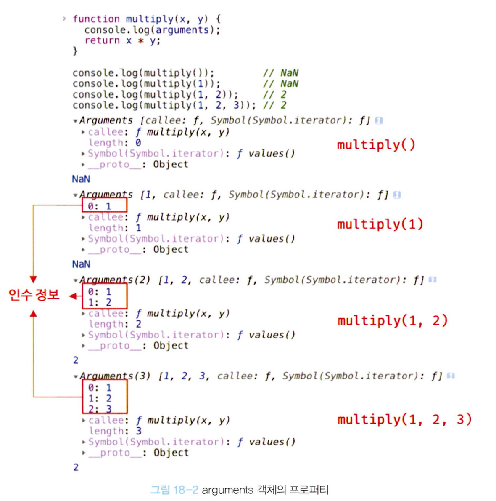

# 함수와 일급 객체

## 일급 객체

다음과 같은 조건을 만족하는 객체를 `일급 객체`라고 이야기 합니다.

1. 무명의 리터럴로 생성할 수 있다. 즉, 런타임에 생성이 가능하다.
2. 변수나 자료구조(객체, 배열 등)에 저장할 수 있다.
3. 함수의 매개변수에 전달할 수 있다.
4. 함수의 반환값으로 사용할 수 있다.

```js
// 1. 함수는 무명의 리터럴로 생성할 수 있다.
// 2. 함수는 변수에 저장할 수 있다.
const increase = function (num) {
  return ++num;
};

// 2. 함수는 객체에 저장할 수 있다.
const auxs = { increase };

function makeCounter(aux) {
  let num = 0;

  // 4. 함수의 반환값으로 사용할 수 있다.
  return function () {
    num = aux(num);
    return num;
  };
}

// 3. 함수의 매개변수에 전달할 수 있다.
const increaser = makeCounter(auxs.increase);
```

> 함수가 일급 객체라는 것은 함수를 객체와 동일하게 사용할 수 있다는 의미입니다.

- 함수는 객체이지만 일반 객체와는 차이가 좀 있습니다. 일반 객체는 호출이 가능합지만, 함수 객체는 호출이 불가능 합니다.

그리고 함수 객체는 고유한 프로퍼티를 소유합니다.

- `arguments`
- `caller`
- `length`
- `name`
- `prototype`

`console.dir`을 통해서 찍어볼 수 있습니다.

`__proto__`는 접근자 프로퍼티이며, Object.prototype객체에서 상속된 프로퍼티 입니다. 해당 부분은 19장 프로토 타입에서 자세히 다룹니다.

### arguments

함수 호출시 전달된 이수들의 정보를 담고 있어 순회 가능한 유사 배열 형태를 띄고 있습니다. 함수 내부에서 지역 변수처럼 사용되기 때문에 외부에서는 참조가 불가능 합니다 `ES3`부터 표준에서 폐지되어 `Function.argument`와 같은 방식으로는 권장되지 않으며 , `arguments`객체를 통해 참조합니다.

함수를 정의할 때 사용하는 매개변수는 지역변수 취급을 받습ㄴ디ㅏ. 호출과 동시에 undefined로 초기화 되고, 전달된 인수가 할당됩니다.

때문에 적은 인수를 전달해도, undefined로 초기화됩니다.

더 많은 인수를 전달할 땐 무시되는데, 이는 실제로 무시되는게 아닌, arguments에 남아서 호출이 가능합니다.



```js
function multiply(x, y) {
  const iterator = arguments[Symbol.iterator]();

  console.log(iterator.next()); // { value: 1, done: false}
  console.log(iterator.next()); // { value: 2, done: false}
  console.log(iterator.next()); // { value: 3, done: false}
  console.log(iterator.next()); // { value: undefined, done: true}

  return x * y;
}

multiply(1, 2, 3);
```

arguments 객체의 Symbol 프로퍼티는 arguments 객체를 순회 가능한 자료구조인 이터러블로 만들기 위한 프로퍼티입니다.

해당 내용은 34장 '이터러블'을 통해 자세히 알아보겠습니다.

> 가변 인자 함수

```js
function sum() {
  let res = 0;

  for (let i = 0; i < arguments.length; i++) {
    res += arguments[i];
  }

  return res;
}

console.log(sum()); // 0
console.log(sum(1, 2)); // 3
console.log(sum(1, 2, 3)); // 6
```

유사 배열이기 때문에 순회가 가능하지만, 메서드를 사용하거나 접근시에는 에러가 발생합니다.

- Function.prototype.call
- Function.prototype.apply

를 통해서 간접적으로 호출할 수 있습니다.

```js
function sum() {
  const array = Array.prototype.slice.call(arguments);
  return array.reduce(function (acc, cur) {
    return acc + cur;
  }, 0);
}

console.log(sum(1, 2)); // 3
console.log(sum(1, 2, 3)); // 6
```

> 동일한 결과가 나옵니다.

조금 번거롭기 때문에 ES6 부터는 rest파라미터가 도입되었습니다.

```js
function sum(...args) {
  return args.reduce((pre, cur) => pre + cur, 0);
}
console.log(sum(1, 2)); // 3
console.log(sum(1, 2, 3)); // 6
```

종종 args를 rest연산자로 풀어서 사용하는 경우를 봤는데, 왜 사용하는지는 명확하게 몰랐는데, 함수 내부 객체 콜을위해서 사용하는걸 조금 알게 된 것 같습니다

rest에 관해서는 26장에서 알아봅니다.

### caller

ES비표준, 알 필요 없음 (아직도 비표준임)

> caller 프로퍼티는 함수 자신을 호출한 함수를 가르킵니다.

```js
foo(bar());
```

이렇게 호출하면 bar의 caller는 foo가 됩니다.

```js
bar();
```

이렇게 하면 caller는 없습니다.

### length

함수를 정의할 때 선언한 매개변수의 개수를 가르킵니다.

주의할 점은 argument.length와 다른 값이라는 것을 인지해야 합니다.

### name

함수의 이름을 나타내는 프로퍼티 입니다.

ES6에서 표준이 되었습니다.

```js
const v = function foo() {};
console.log(v.name); // foo

const a = function () {};
console.log(a.name); // a

const b = () => {};
console.log(b.name); // b
```

함수 선언문으로 선언된 함수는 함수의 이름이 아닌, 변수 식별자의 이름이 호출됩니다.

### **proto** 접근자

모든 객체는 [[Prototype]]이라는 내부 슬롯을 갖습니다. 상속을 위한 프로토타입 객체를 가르킵니다.

**proto**는 내부 슬롯에 접근학기 위한 간접적인 방법입니다.

```js
const obj = { a: 1 };

console.log(obj.hasOwnProperty('a')); // true
console.log(obj.hasOwnProperty('__proto__')); // false
```

non-constructor에는 prototype프로퍼티가 존재하지 않습니다.

```js
(function () {}).hasOwnProperty('prototype'); // true
({}).hasOwnProperty('prototype'); // false
```
