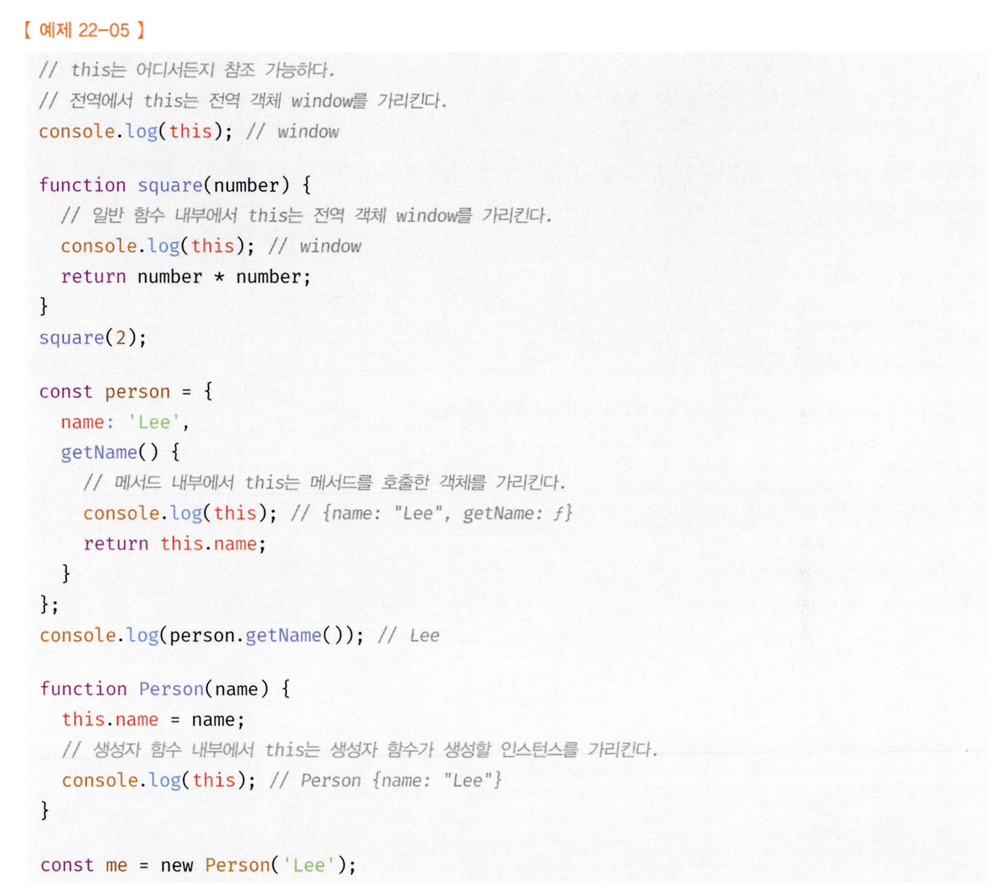
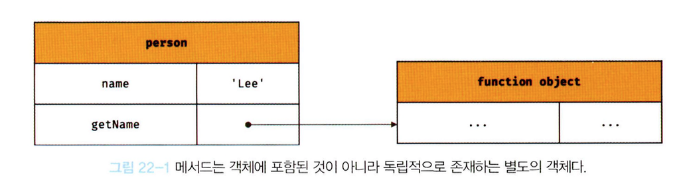

# 22장 this

객체는 `상태`를 나타내는 프로퍼티와 `동작`을 나타내는 메서드를 하나의 논리적인 단위로 묶음 복합적인 자료구조 입니다.

`동작`을 나타내는 메서드는 자신이 속한 객체를 가리키는 식별자를 참조할 수 있어야 합니다.

```js
// 객체 리터럴로 생성된 방식

const circle = {
  radius: 5,
  getDiameter() {
    return 2 * circle.radius;
  },
};

console.log(circle.getDiameter()); // 10
```

객체 리터럴로 생성된 객체에 대해서는 getDimeter 메서드가 호출되는 시점에 이미 객체 리터럴의 평가가 완료되어 객체가 생성되었고, circle식별자에 생성된 객체가 할당된 이후기 때문에 circle 식별자를 참조가 가능합니다.

```js
// 생성자 함수로 생성된 방식
function Circle(radius) {
    ??.radius = radius;
}


Circle.prototype.getDiameter = function() {
    return 2 * ??.radius;
}

const circle = new Circle(5);
```

new 연산자를 통해서 생성자 함수를 정의하는 시점에는 아직 인스턴스가 생성되기 이전이기 때문에 참조할 값을 찾을 수 없습니다.

이 때 자신이 속한 객체 또는 인스턴스에 대해서 가르키는 특수한 식별자가 바로 `this`입니다.

`this`는 자바스크립트 엔진에 의해서 아묵적으로 생성되며, 코드 어디서든 참조가 가능합니다.
`arguments`객체와 동일하게 지역 변수처럼 사용이 가능합니다.

> 단, this가 가르키는 값 즉, this 바인딩은 함수 호출 방식에 의해 동적으로 결정됩니다.

- 자바서크립트의 this는 함수가 호출되는 방식에 따라서 this에 바인딩 될 값잉 동적으로 결정됩니다.



this는 객체의 프로퍼티나 메서드를 참조하기 위한 자기 참조 변수이므로, 일반적으로 함수 내부, 객체 메서드 내부에서나 의미가 있습니다. 때문에 strict mode가 적용된 일반 함수는 this를 사용시 undefined가 바인딩 됩니다.

## 함수 호출방식과 this 바인딩

1. 일반 함수 호출
2. 메서드 호출
3. 생성자 함수 호출
4. Function.prototype.apply/call/bind 메서드에 의한 간접호출

```js
// this 바인딩은 함수 호출 방식에 따라 동적으로 결정된다.
const foo = function () {
  console.dir(this);
};

// 1. 일반 함수 호출
foo(); // window

// 2. 메서드 호출
const obj = { foo };
obj.foo(); // obj

// 3. 생성자 함수 호출
new foo(); // foo {}

// 4. Function.prototype.apply/call/bind 메서드에 간접 호출
const bar = { name: 'bar' };

foo.call(bar); // bar
foo.apply(bar); // bar
foo.bind(bar)(); // bar
```

사실 위 코드 하나만 보면 끝입니다.

1. 일반 함수의 내부 this는 전역 객체인 window을 가르킵니다.
2. 메서드를 호출한 객체 obj를 가르킵니다.
3. 생성자 함수가 생성한 인스턴스를 가르킵니다.(미래의)
4. 간접 적으로 호출시, 내부에 인수에 의해서 결정됩니다.

### 일반 함수 호출

- 기본적으로 this에 전역 객체가 바인딩 됩니다.

만약 콜백함수가 일반 함수로 호출된다면 해당 콜백함수 내부의 this에도 전역 객체가 바인딩 됩니다.

메서드 내부의 중첩함수나, 콜백 함수의 this 바인딩을 메서의 this와 일치시키기 위해서 다음과 같이 사용합니다.

```js
const obj = {
  value: 100,
  foo() {
    const that = this;
    setTimeout(function () {
      console.log(that.value); // 100
    }, 100);
  },
};

obj.foo();
```

이외에도 Function.prototype.apply, Function.prototype.call, Function.prototype.bind 메서드를 제공합니다.

```js
js;
const obj = {
  value: 100,
  foo() {
    setTimeout(
      function () {
        console.log(this.value); // 100
      }.bind(this),
      100
    );
  },
};

obj.foo();
```

화살표 함수 내부의 this는 상위 스코프의 this를 가르킵니다. 때문에 this를 호출해도 100을 찍을 겁니다.

### 메서드 호출

```js
const person = {
  name: 'Lee',
  getName() {
    return this.name;
  },
};

console.log(person.getName()); // Lee
```

person 객체 내부에서 선언된 메서드는 person객체에 포함된게 아니고, 독립적으로 존재합니다. getName 프로퍼티가 함수 객체를 가르키고 있을 뿐 입니다.


```js
const anotherPerson = {
  name: 'Kim',
};

anotherPerson.getName = person.getName;

console.log(anotherPerson.getName()); // Kim

const getName = person.getName;

console.log(getName()); // ''
```

위 코드처럼, 다른 객체의 메서드가 될 수 있고, 일반 변수에 할당해 일반 함수로 호출도 가능합니다.
코드 마지막에 빈 값('')이 찍힌 이유는 함수 내부의 this가 전역객체를 바인딩하기 때문입니다.

프로토타입 메서드 내부에서 사용된 this도 일반 메서드와 마찬가지로 호출한 객체에 바인딩 됩니다.

```js
function Person(name) {
  this.name = name;
}

Person.prototype.getName = function () {
  return this.name;
};

const me = new Person('Lee');

console.log(me.getName()); // Lee

Person.prototype.name = 'Kim';

console.log(Person.prototype.getName()); // Kim
```

위 코드에서 첫 번째 호출시 나오는 Lee는, getName을 호출한 객체가 me 이기 때문에 this가 me를 가르켜서 출력된 결과입니다.

두 번째 호출시 나오는 Kim은 호출한 객체가 Person.prototype이기 때문에 Kim을 찍은 것 입니다.

### 생성자 함수 호출

생성자 함수 내부의 this는 미래에 생성할 인스턴스가 바인딩 됩니다.

new 연산자를 쓴 시점에 초기화된 값이나, 그 이후 접근된 값에 따라서 동적으로 변화합니다.

### Function.prototype.apply/call/bind 메서드에 의한 간접 호출

apply와 call메서드의 본질적인 기능은 함수를 호출하는 것 입니다.

```js
function getThisBinding() {
  return this;
}

const thisArg = { a: 1 };

console.log(getThisBinding()); // window

console.log(getThisBinding().apply(thisArg)); // { a : 1 }
console.log(getThisBinding().call(thisArg)); // { a : 1 }
```

```js
function getThisBinding() {
  console.log(arguments);
  return this;
}
const thisArg = { a: 1 };

console.log(getThisBinding().apply(thisArg, [1, 2, 3]));
// Arguments(3) [1, 2, 3, callee: f, (Symbol.iterator): f]
// { a : 1 }
console.log(getThisBinding().call(thisArg, 1, 2, 3)); // { a : 1 }
// Arguments(3) [1, 2, 3, callee: f, (Symbol.iterator): f]
// { a : 1 }
```

arguments는 유사배열이기 때문에 배열의 메서드로 순회가 가능합니다.

`Function.prototype.bind`의 경우에는 apply와 call처럼 함수를 호출하지 않습니다. 다만 첫 번째 인수로 전달한 값으로 this바인딩이 교체된 함수를 새롭게 생성해 반환합니다.

```js
function getThisBinding() {
  return this;
}

const thisArg = { a: 1 };

console.log(getThisBinding.bind(thisArg)); // getThisBinding
console.log(getThisBinding.bind(thisArg)()); // { a: 1 }
```

bind메서드는 메서드의 this와 메서드 내부의 중첩 함수 또는 콜백 함수의 this가 불일치하는 문제를 해결하기 위해 유용하게 사용됩니다.

```js
const person = {
  name: 'Lee',
  foo(callback) {
    // 1.
    setTimeout(callback, 100);
  },
};

person.foo(function () {
  console.log(`Hi! my name is ${this.name}`); // 2.
  // Hi! my name is
});
```

person.foo 내부의 콜백함수가 호출되기 이전 1번 시점에서 this는 foo메서드를 호출한 객체 person을 가르킵니다. 그러나 person.foo의 콜백 함수가 일반 함수로서 호출된 2번 시점에서는 this가 전역객체를 가르키기 때문에 아무것도 찍히지 않습니다.

```js
const person = {
  name: 'Lee',
  foo(callback) {
    // 1.
    setTimeout(callback.bind(this), 100);
  },
};

person.foo(function () {
  console.log(`Hi! my name is ${this.name}`); // 2.
  // Hi! my name is Lee
});
```
