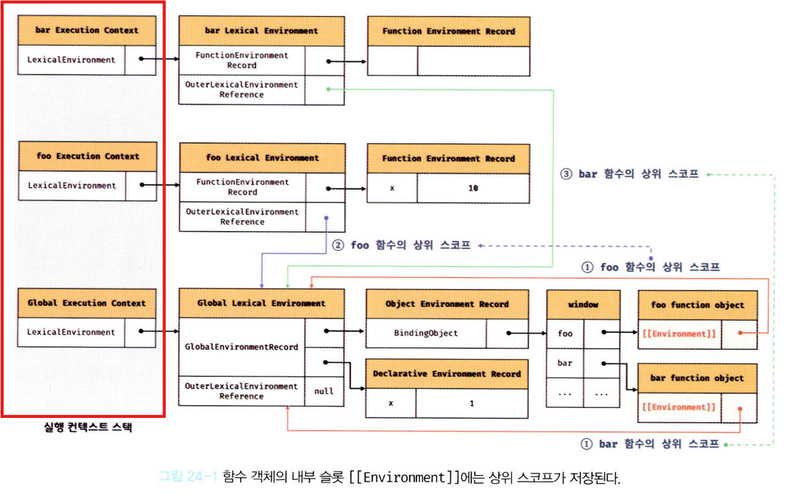
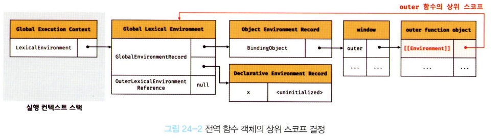
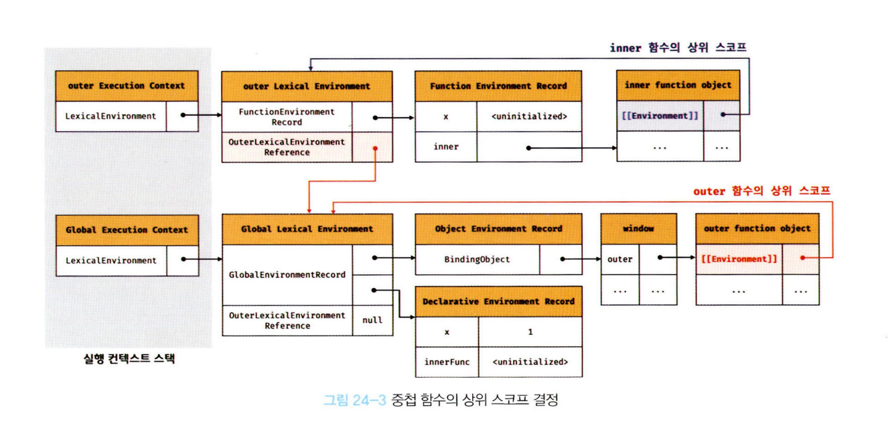
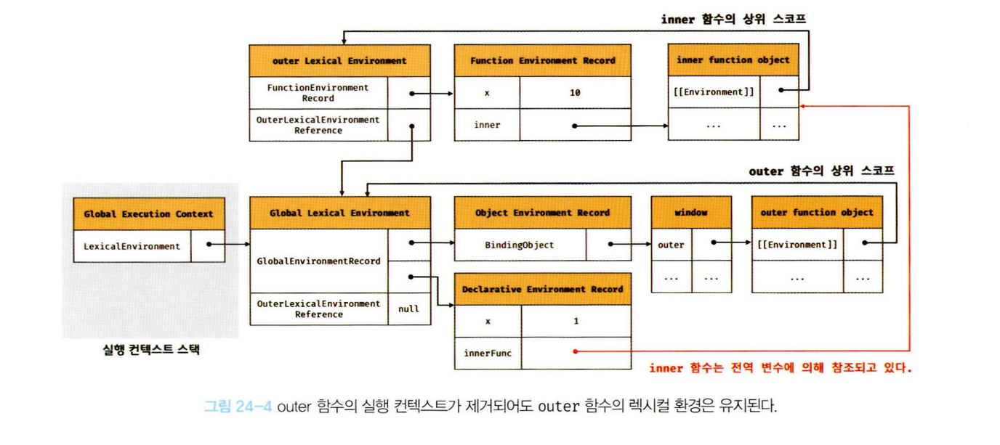
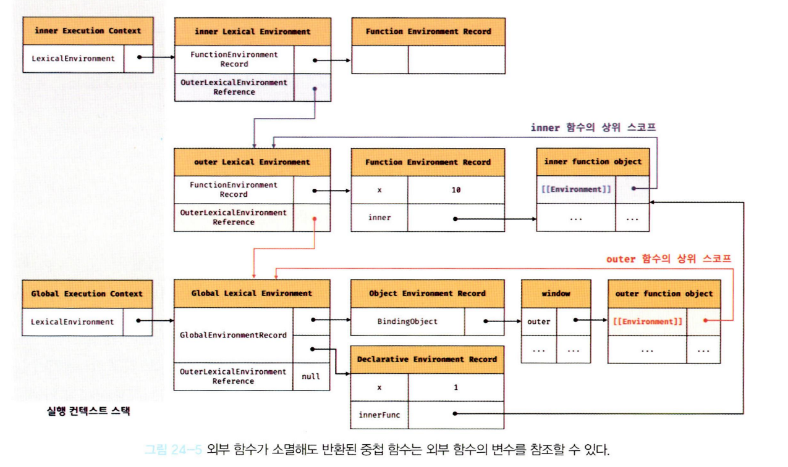
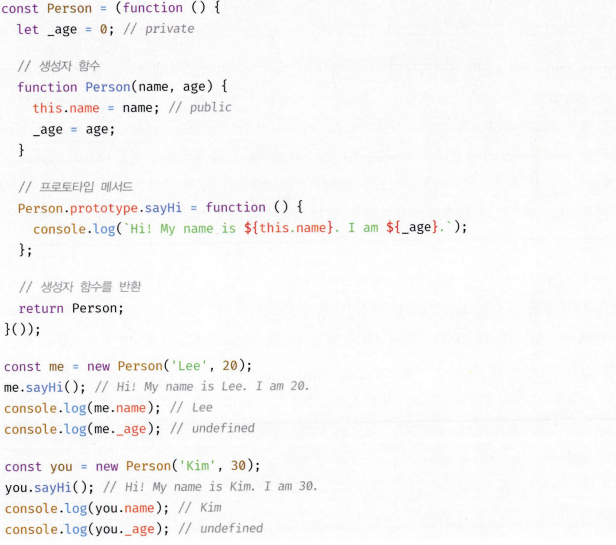
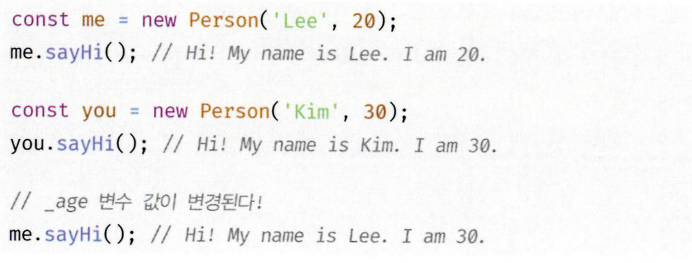
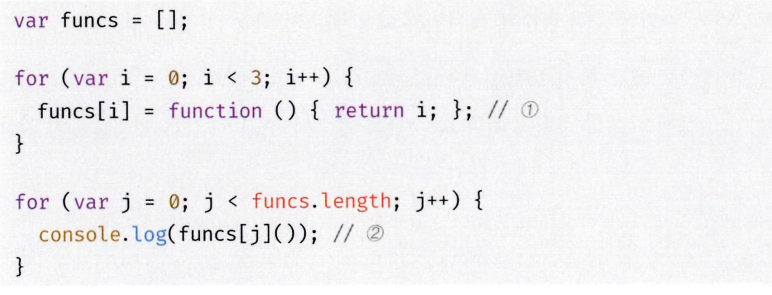
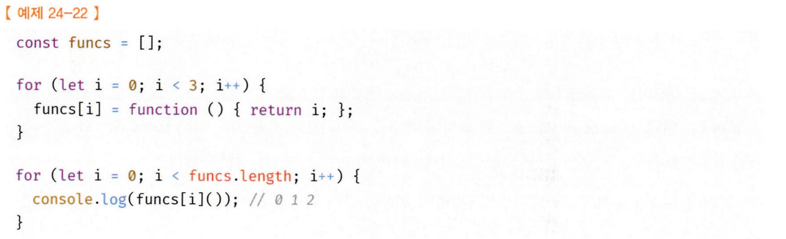
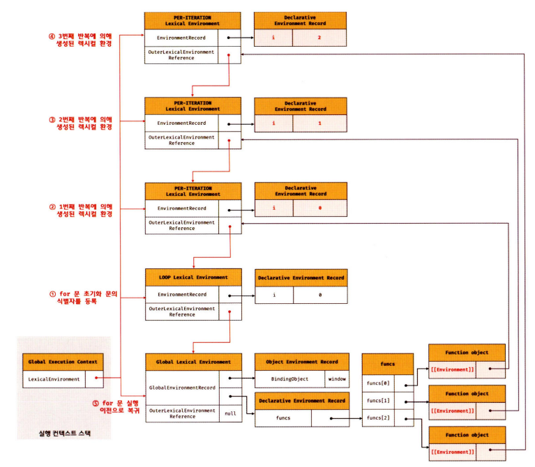

# 24.클로저

## 클로저?

클로저는 js만의 개념은 아니고 함수를 일급 객체 취급하는 모든 언어의 특징

예제를 통한 클로저의 정의를 알아보자

```ts
const x = 1;
function outer() {
  const x = 10;

  function inner() {
    console.log(x);
  }
  inner();
}

outer();
```

`outer` 내부에 중첩 함수 `inner`가 정의, 호출되고 있다.

이때 중첩함수인 `inner`의 상위 스코프는 `outer`함수이다.

따라서 `inner`는 `outer` 내부에 정의된 변수 `x`에 접근 가능하다.

이게 가능한 이유는 js는 **렉시컬 스코프** 를 따르는 프로그래밍 언어이기 떄문

## 24.1 렉시컬 스코프

### 핵심

자바스크립트 엔진은 함수를 어디서 호출한지가 아닌 어디에서 정의했는지에 따라서 상위 스코프를 결정한다.

이를 렉시컬 스코프(정적 스코프) 라고 함

```ts
const x = 1;

function foo() {
  const x = 10;
  bar();
}

function bar() {
  console.log(x);
}

foo(); // 1
bar(); // 1
```

핵심에서 알아본거와 같이 정적 스코프를 가지기 떄문에 둘 다 상위 스코프는 전역이다.

어디서 호출하는진 중요하지않아요

여기서 스코프는 실행 컨텍스트 안에 있는 렉시컬 환경이다.
렉시컬 환경 안에는 **외부 렉시컬 환경에 대한 참조**
를 통해 상위 렉시컬 환경과 연결된다.
=> 스코프 체인

정적 스코프로 결정한다는것은
외부 렉시컬 환경 참조 칸에 어떤 렉시컬 환경을 넣느냐?와 같음

### 24.2 내부 슬롯 [[Environment]]

함수는 정의된 환경과 실행하는 환경(스코프)가 다를 수 있는데.

정적 스코프가 가능하려면 호출되는 상황과 상관없이
상위 스코프를 기억하고 있어야 함

이를 위해 함수 내부의 `[[Environment]]` 내부 슬롯에 상위 스코프의 참조를 저장한다.

함수 내부의`[[Environment]]` 슬롯에 저장할땐 현재 실행중인 실행 컨텍스트의 렉시컬 환경을 저장함

왜냐하면?

```ts
const x = 1;
function outer() {
  const x = 10;

  function inner() {
    console.log(x);
  }
  inner();
}

outer();
```

1. outer 함수가 실행될 때 outer 실행 컨텍스트 생성
2. inner 함수가 정의되며 정적 스코프 생성
3. inner의 내부 슬롯에 외부 참조에는 현재 스코프 저장(outer의 렉시컬 환경)

함수 내부의 `[[Environment]]` 에 저장된 외부 렉시컬 환경 참조, 즉 상위 스코프는
자신이 존재하는 한 계쏙 유지된다.

```ts
const x = 1;

function foo() {
  const x = 10;
  bar();
}

function bar() {
  console.log(x);
}

foo(); // 1
bar(); // 1
```



함수 선언문으로 정의된 함수 foo, bar는 전역 객체에 메서드가 된다.

함수가 호출되면 실행 컨텍스트가 생성되며
함수 코드는 다음과 같은 순서로 평가된다.

1. 실행 컨텍스트 생성
2. 함수 렉시컬환경 생성
   - 함수 환경 레코드 생성
   - this 바인딩
   - 외부 렉시컬 환경 참조 결정

## 24.3 클로저와 렉시컬 환경

```ts
const x = 1;

function outer() {
  const x = 10;
  const inner = function () {
    console.log(x);
  };
  return inner;
}

const innerFunc = outer();
innerFunc();
```

`outer`함수는 `inner`함수를 반환하고 ㅅ생명주기를 마감한다.(실행 컨텍스트 제거)

`outer`함수의 지역변수 `x`도 `outer`함수가 없어졌으므로 접근할 수 있는 방법이 없어 보인다.

그러나 `innerFunc`를 호출하면 실행 결과 `10`이 나오는데 생명주기가 마감된`outer`함수의 지역변수가 부활한듯 작동

이처럼 외부 함수보다 중첩 함수가 더 오래 유지되는 경우 내부 함수는 외부 함수의 변수를 참조 가능하다.
이러한 중첩함수를 **클로저**라고 한다.

## 클로저 내부 과정

### 1


그림을 보면 `outer`의 `[[Environment]]` 슬롯에 전역 렉시컬 환경을 등록합니다.

### 2


`ouetr`함수가 실행되면 `inner`함수를 반환하며
`outer`함수의 생명주기가 종료됩니다.

이때 `inner`는 `outer`함수 내부에 정의되있으므로
`outer`의 렉시컬 환경을 `[[Environment]]`에 저장합니다.

### 3


`ouetr`함수가 종료되더라도 `inner`함수가 참조하고 있기 때문에 가비지컬렉션 대상이 되지 않는다

### 4


`inner`함수를 호출하면 실행 컨텍스트가 생성되고 이전 과정에서 저장한 `outer`의 렉시컬 환경을 참조한다.

`inner`는 `outer` 보다 오래 생존하고 `outer` 내부의 값(변수)를 변경 가능하다

js의 모든 함수는 모두 상위 스코프를 기억하기 때문에 이론상으로 다 클로저라고 볼 수 있지만
모든 함수를 클로저라고 하지는 않는다.

클로저는 내부 함수가 외부 함수의 식별자를 참조하고

내부 함수가 외부 함수보다 더 오래 유지되는경우를 클로저라고 한다.

```ts
function foo() {
  const x = 10;
  const y = 20;

  function bar() {
    console.log(x);
  }
  return bar;
}
```

`bar`함수가 상위 스코프의 변수 `x, y`중 x만 참조하고 있다.

브라우저 엔진은 최적화를 통해 식별자 중 클로저가 참조하는 `x`만 을기억해 최적화를 진행한다.

이때 `x`를 **자유 변수** 라고 부른다.

## 24.4 클로저 활용

클로저는 상태를 안전하게 변경하고 유지하기 위해서 사용한다.

특정 함수에게만 상태 변경을 허용하여 상태를 안전하게 은닉한다.

```ts
let num = 0;

const increase = function () {
  return ++num;
};

console.log(increase()); //1
console.log(increase()); //2
console.log(increase()); //3
```

전역으로 num변수가 있기 때문에
누구나 num을 변경 가능하기에 때문에 좋지 않은 코드이다.

```ts
const increase = function () {
  let num = 0;
  return ++num;
};
console.log(increase()); //1
console.log(increase()); //1
console.log(increase()); //1
```

`increase`만 `num`을 변경 가능하지만 이전 상태를 저장하지 못하기에 클로저를 사용해야 한다.

```ts
const increase = (function () {
  let num = 0;

  return function () {
    return ++num;
  };
})();

console.log(increase()); //1
console.log(increase()); //2
console.log(increase()); //3
```

클로저에 의해 은닉화된 변수 `num`은 `increase`로만 접근 가능하기 때문에 안전하게 상태를 변경 가능하다.

## 24.5 캡슐화와 정보 은닉

캡슐화는 객체의 상태를 나타내는 프로퍼티와 이를 참조하고 변경하는 메서드를 하나로 묶는것을 의미한다.

객체의 특정 프로퍼티와 메서드를 감출 목적으로 사용하기도 하는데 이를 `정보 은닉` 이라고 한다.

정보 은닉을 통해 외부에서의 접근을 막아 정보를 보호하고
객체간 의존성을 낮추어 결합도를 낮추는 효과가 있다.

대부분 객체지향 언어는 `private`를 통해 캡슐화가 가능하지만 `js`는 지원하지 않기에 기본적으로 외부에 공개된다.

```ts
function Person(name, age) {
  this.name = name;
  let _age = age;

  this.sayHi = function () {
    console.log(name, age);
  };
}

const me = function Person('Lee',20);
me.sayHi();

console.log(me.name) //'Lee'
console.log(me._age) // undefined
```

`name`프로퍼티는 외부에 공개되어 누구나 참조 가능하다.
하지만 `_age`는 Person 생성자 함수의 지역 변수이므로 외부에서 변경할 수 없다.

sayHi 메서드의 중복 생성 방지를 위해 prototype으로 등록해보자.

```ts
function Person(name, age) {
  this.name = name;
  let _age = age;

}
Person.prototype.sayHi = unction () {
    console.log(name, age);
  };
```

`Person.prototype.sayHi` 메서드 내부에서 \_age를 참조할 수 없는 문제가 발생한다.

위와같은 패턴을 사용하여 즉시실행함수는
`Person` 생성자 함수를 반환하고 `Person.prototype.sayHi`도 지역변수를 기억하는 클로저이므로 public, private를 사용하지 않고도 정보 은닉이 가능하다.

하지만 해당 패턴도 문제가 있다.

위와같은 경우 `Person`생성자 함수는 동일한 렉시컬 환경을 참조하기 때문에 \_age 상태가 유지되지 않는다.

책에서도 완전하게 private를 지원하지 않는다고 되어있고, 현재에는 새로운 표준 사항이 나와서 private를 사용할 수 있는 것 같습니다.

## 24.6 자주 발생하는실수



해당 예제에서 호출을 하면 0, 1, 2가 나올 것 같지만
for문에서 사용된 var는 함수레벨 스코프이기 때문에
각 배열에 든 함수가 참조한 i는 전역 변수가 되어 모두 3이 출력된다.


간단한 해결방법은 var 대신 let을 사용하는 것이다.

let을 사용하게되면 for 루프마다 렉시컬 환경이 생성되어 각 렉시컬 환경을 참조하는 여러 함수가 생성된다.
