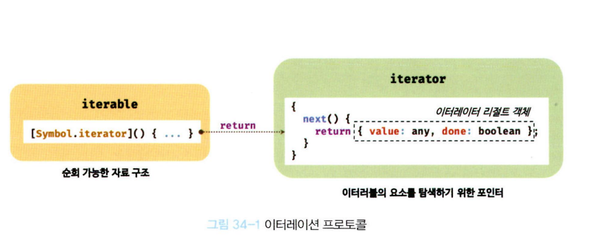
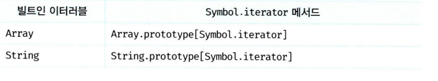
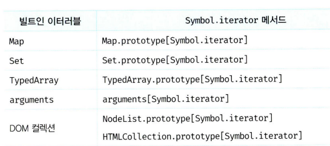
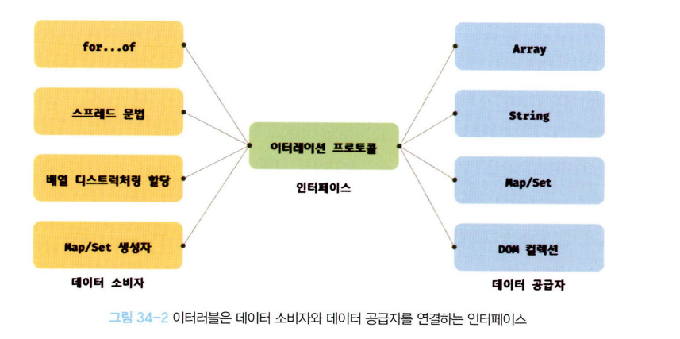

# 이터러블

### 이터레이션 프로토콜

순회 가능한 자료구조를 만들기위해 ECMAScript 사양에 정의된 규칙이다.

ES6 이전에는 통일된 사양 없이 각자의 구조를 가지고 for, forEach 메서드 등으로 순회가 가능했다.

이를 ES6에서는 이터레이션 프로토콜로 통일했다고 합니다..

이터레이션 프로토콜은 다음 2가지가 존재한다.

### 이터러블 프로토콜

객체가 `Symbol.iterator` 라는 메서드를 보유해야 한다. 이를 호출하면 `이터레이터` 라는 객체가 반환하는데 이런 규칙을 이터러블 프로토콜이라고 함, 이터러블은 for... of, ..., 배열 디스트럭처링 할당이 가능하다.

### 이터레이터 프로토콜

이터러블의 Symbol.iterator 메서드를 호출하면 이터레이터 프로토콜을 준수한 이터레이터를 반환한다. 이터레이터는
next 메서드를 소유한다.
next() 메서드를 호출할 때마다, 이터러블의 다음 요소를 특정 형식으로 반환합니다.

반환 형식:

```
{ value: [데이터 값], done: [순회 종료 여부] }
```

done: false: 아직 꺼낼 데이터가 남았다.

done:true: 모든 데이터를 다 꺼냈고 순회가 끝났다.


이터러블 (Iterable): for...of 문처럼 반복시킬 수 있는 데이터 묶음 (예: 배열, 문자열)입니다. "순회 가능한 객체"라고도 부릅니다.

이터레이터 (Iterator): 그 데이터 묶음을 하나씩 순서대로 꺼내는 역할을 하는 "포인터" 또는 "일꾼"입니다.

## 34. 이터러블

이터러블 프로토콜을 준수한 객체를 이터러블이라고 한다.

### 예제1

```ts
const isIterable = (v) =>
  v !== null && typeof v[Symbol.iterator] === 'function';
// 배열, 문자열, Map, Set 등은 이터러블이다.
isIterable([]); //- true
isIterable(''); // - true
isIterable(new Map()); // - true
isIterable(new Set()); // - true
isIterable({}); // - false
```

이터러블인지 확인하는 코드

### 예제2

```ts
const array = [1, 2, 3];
// 배열은 Array.prototype의 Symbol.iterator 메서드를 상속받는 이터러블이다.
console.log(Symbol.iterator in array); // true
// 이터러블인 배열은 for... of 문으로 순회 가능하다.
for (const item of array) {
  console.log(item);
}
// 이터러블인 배열은 스프레드 문법의 대상으로 사용할 수 있다.
console.log([...array]); // [1, 2, 3]

// 이터러블인 배열은 배열 디스트럭처링 할당의 대상으로 사용할 수 있다.
const [a, ...rest] = array;
console.log(a, rest); // 1, [2, 3]
```

for... of 문으로 순회할 수 있으며, 스프레드 문법과 배열 디스트럭처링 할당의 대상으로 사용가능

### 예제3

```ts
const obj = { a: 1, b: 2 };
// 일반 객체는 Symbol.iterator 메서드를 구현하거나 상속받지 않는다.
// 따라서 일반 객체는 이터러블 프로토콜을 준수한 이터러블이 아니다.
console.log(Symbol.iterator in obj); // false
// 이터러블이 아닌 일반 객체는 for... of 문으로 순회할 수 없다.
for (const item of obj) {
  // - TypeError: obj is not iterable
  console.log(item);
}
// 이터러블이 아닌 일반 객체는 배열 디스트럭처링 할당의 대상으로 사용할 수 없다.
const [a, b] = obj; // - ТypeError: obj is not iterable
```

Symbol.iterator 메서드를 직접 구현하지 않거나 상속받지 않은 일반 객체는 이터러블 프로토콜을 준수
한 이터러블이 아니다. 따라서 일반 객체는 for ... of 문으로 순회할 수 없으며 스프레드 문법과 배열 디스트
럭처링 할당의 대상으로 사용할 수 없다.

### 예외상황

```ts
const obj = { a: 1, b: 2 };
// 스프레드 프로퍼티 제안(Stage 4)은 객체 리터럴 내부에서 스프레드 문법의 사용을 허용한다.
console.log({ ...obj }); // { a: 1, b: 2}
```

2021년 1월 , TC39 프로세스의 stage 4(Finished) 단계에 제안되어 있는 스프레드 프로퍼티 제안
은 일반 객체에 스프레드 문법의 사용을 허용한다.

## 34.2 이터레이터

이터러블의 `Symbol.iterator ` 메서드를 호출하면 이터레이터 프로토콜을 준수한 이터레이터를 반환한다.

이터러블의 `Symbol.iterator` 메서드가 반환한 이터레이터는 `next` 메서드를 갖는다.

### 예제 1

```ts
// 배열은 이터러블 프로토콜을 준수한 이터러블이다.
const array = [1, 2, 3];
// Symbol.iterator 메서드는 이터레이터를 반환한다.
const iterator = array[Symbol.iterator]();
// Symbol.iterator 메서드가 반환한 이터레이터는 next 메서드를 갖는다.
console.log('next' in iterator); // true
```

이터레이터의 next 메서드는 이터러블의 각 요소를 순회하기 위한 포인터의 역할을 한다.

### 예제2

```ts
const array = [1, 2, 3];
const iterator = array[Symbol.iterator]();

// 이터레이터 리절트 객체는 value와 done 프로퍼티를 갖는 객체다.
console.log(iterator.next()); // { value: 1, done: false }
console.log(iterator.next()); // { value: 2, done: false }
console.log(iterator.next()); // { value: 3, done: false }
console.log(iterator.next()); // { value: undefined, done: true }
```

이터레이터의 ` next` 메서드가 반환하는 리절트 객체의 `value` 프로퍼티는 현재 순회 중인 이터러
블의 값을 나타내며 `done` 프로퍼티는 이터러블의 순회 완료 여부를 나타낸다.

## 34.3 빌트인 이터러블




## 34.4 for ... of문

내부적으로 이터레이터의 `next`를 호출하며 이터러블을 순회한다.

## 34.4 이터러블과 유사 배열 객체

사 배열 객체는 마치 배열처럼 인덱스로 프로퍼티 값에 접근할 수 있고 length 프로퍼티를 갖는 객체를 말
한다.

```ts
// 유사 배열 객체
const arrayLike = {
  0: 1,
  1: 2,
  2: 3,
  length: 3,
};
// 유사 배열 객체는 length 프로퍼티를 갖기 때문에 for 문으로 순회할 수 있다.
for (let i = 0; i < arrayLike.length; i++) {
  // 유사 배열 객체는 마치 배열처럼 인덱스로 프로퍼티 값에 접근할 수 있다.
  console.log(arrayLike[i]); //1, 2, 3
}
```

이는 이터러블 객체가 아니기에 for...of로 순회가 불가능하다.

arguments, NodeList HTMLCollection은 유사 배열 객체이면서 이터러블이다.

ES6 에서 이터러블이 도입되면서 유사 배열 객체인 arguments, NodeList, HTMLCollection 객체에 Symbol.
iterator 메서드를 구현하여 이터러블이 되었다.

하지만 이터러블이 된 이후에도 length 프로퍼티를 가지며
인덱스로 접근할 수 있는 것에는 변함이 없으므로 유사 배열 객체이면서 이터러블인 것이다.

## 34.5 이터레이션 프로토콜 중요성

앞서 언급했지만 ES6 이전의 순회 가능한 데이터 컬렉션, 즉 배열, 문자열, 유사 배열 객체, DOM 컬렉션 등
은 통일된 규약 없이 각자 나름의 구조를 가지고 for 문, for ... in 문, foreach 메서드 등 다양한 방법으로
순회할 수 있었다.

(요약)
인터페이스가 모두 다르면 다양한 인터페이스에 맞게 구현해야 하지만 이터레이션 프로토콜이 존재하기 때문에 해당 프로토콜만 지원하도록 구현하면 된다


## 34.6 사용자 정의 이터러블

```ts
// 피보나치 수열을 구현한 사용자 정의 이터러블
const fibonacci = {
    // Symbol.iterator 메서드를 구현하여 이터러블 프로토콜을 준수한다.
    [Symbol.iterator]() {
        let [pre, cur] = [0, 1]; // 36.1절 "배열 디스트럭처링 할당" 참고
        const max = 10; // 수열의 최대값
        // Symbol.iterator 메서드는 next 메서드를 소유한 이터레이터를 반환해야 하고
        // next 메서드는 이터레이터 리절트 객체를 반환해야 한다.
        return next() {
            [pre, cur] = [cur, pre + cur]; // 36.1절 "배열 디스트럭처링 할당" 참고
            // 이터레이터 리절트 객체를 반환한다.
            return { value: cur, done: cur >= max };
        }
    }
};
// 이터러블인 fibonacci 객체를 순회할 때마다 next 메서드가 호출된다.
for (const num of fibonacci) {
    console.log(num); // 12 3 58
}
```

사용자 정의 이터러블은 이터레이션 프로토콜을 준수하도록 Symbol.iterator 메서드를 구현하고 Symbol.
iterator 메서드가 next 메서드를 갖는 이터레이터를 반환하도록 한다.

### 이터러블을 반환하는 함수

```ts
// 피보나치 수열을 구현한 사용자 정의 이터러블을 반환하는 함수
// 수열의 최대값을 인수로 전달받는다.
const fibonacciFunc = function (max) {
    let [pre, cur] = [0, 1];
    // Symbol.iterator 메서드를 구현한 이터러블을 반환한다.
    return {
        [Symbol.iterator]() {
            return next() {
                [pre, cur] = [cur, pre + cur];
                return { value: cur, done: cur >= max };
            }
        };
    }
};

// 이터러블을 반환하는 함수에 수열의 최대값을 인수로 전달하면서 호출한다.
// fibonacciFunc(10)은 이터러블을 반환한다.
for (const num of fibonacciFunc(10)) {
console.log(num); // 1235 8
}

```

### 이터러블이면서 이터레이터인 객체

```ts
// 이터러블이면서 이터레이터인 객체
{

[Symbol.iterator]() { return this; },
    next() {
    return { value: any, done: boolean };
}
}
```

Symbol.iterator 메서드와 next 메서드를 소유한 이터러블이면서 이터레이터다.

Symbol.iterator 메서드는 this를 반환하므로 next 메서드를 갖는 이터레이터를 반환한다.

```ts
const fibonacciFunc = function (max) {
  let [pre, cur] = [0, 1];

  return {
    //Symbol.iterator와 next를 소유하기때문에 이터러블, 이터레이터임
    [Symbol.iterator]() {
      return this;
    },
    next() {
      [pre, cur] = [cur, pre + cur];
      return { value: cur, done: cur >= max };
    },
  };
};
let iter = fibonacciFunc(10);
for (const num of iter) {
  console.log(num); // 1 2358
}
```

### 34.6.4 무한 이터러블과 지연 평가

```ts
const fibonacciFunc = function () {
  let [pre, cur] = [0, 1];

  return {
    [Symbol.iterator]() {
      return this;
    },
    next() {
      [pre, cur] = [cur, pre + cur];
      // 무한을 구현해야 하므로 done 프로퍼티를 생략한다.
      return { value: cur };
    },
  };
};
// 배열 디스트럭처링 할당을 통해 무한 이터러블에서 3개의 요소만 취득한다.
const [f1, f2, f3] = fibonacciFunc();
console.log(f1, f2, f3); // 12 3

// fibonaccifunc 함수는 무한 이터러블을 생성한다.
for (const num of fibonacciFunc()) {
  if (num > 10000) break;
  console.log(num); // 12 3 5 8... 4181 6765
}
```
