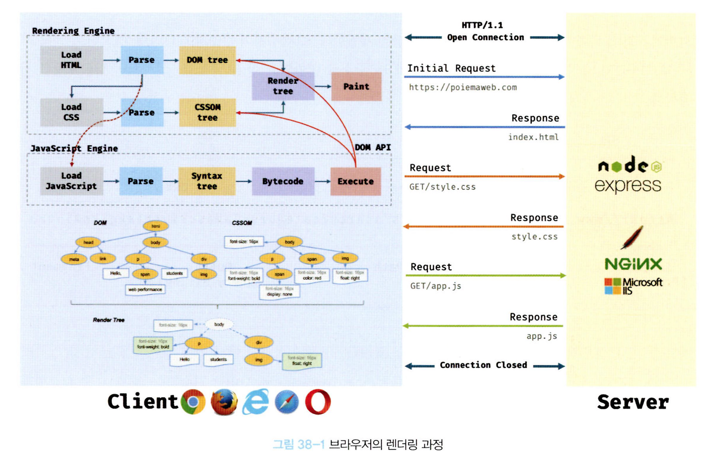
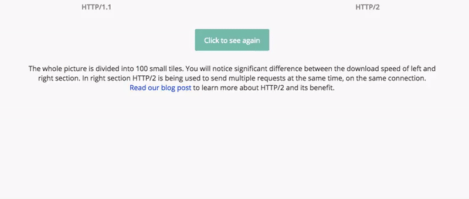
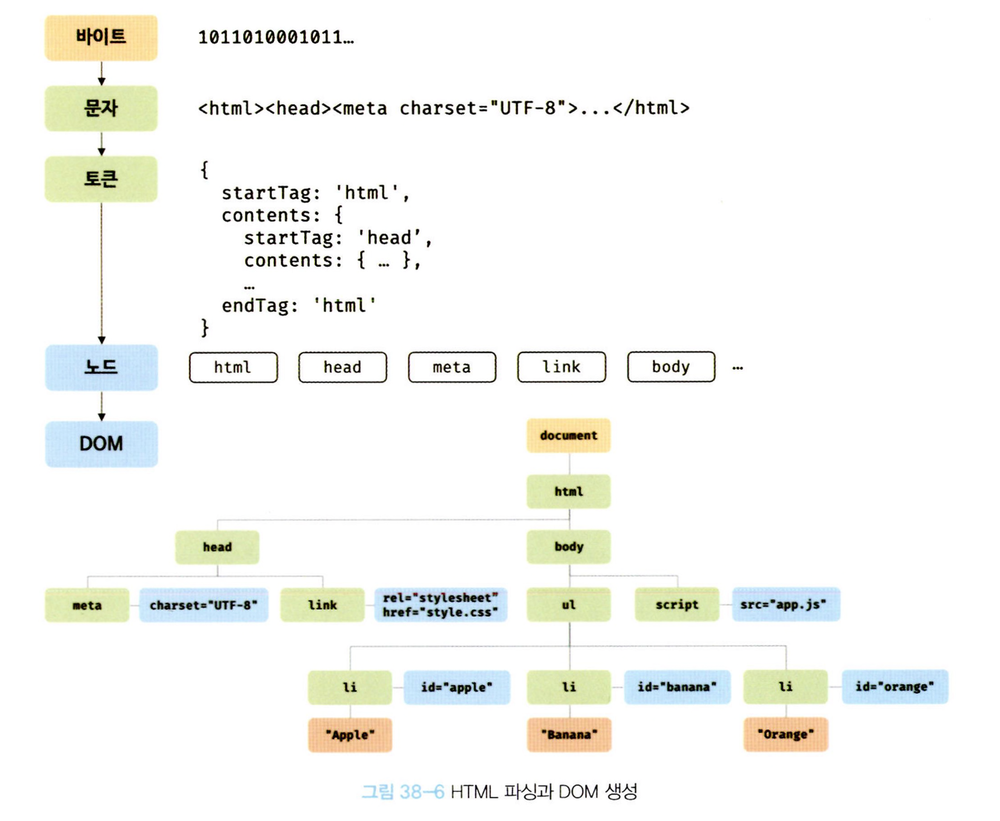
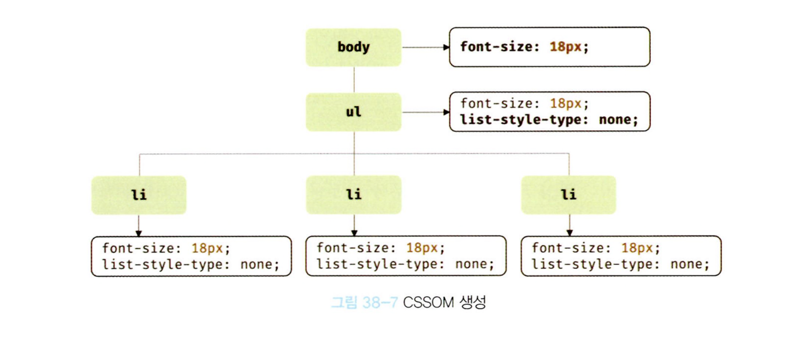
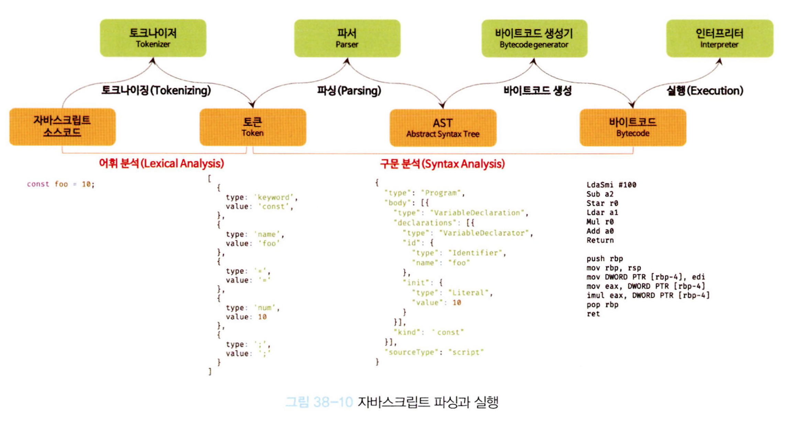
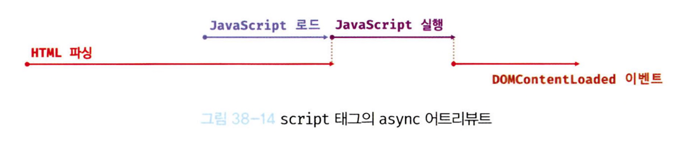
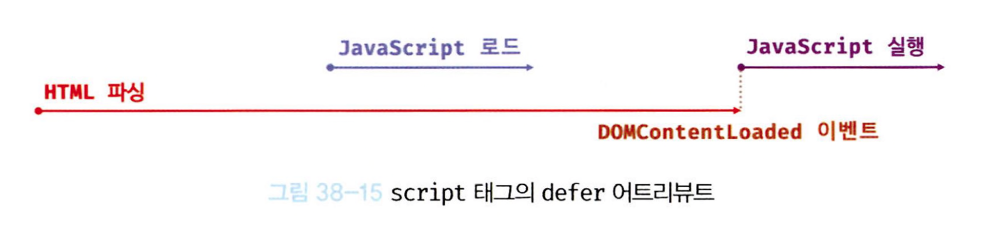

# 브라우저의 렌더링 과정

구글의 V8 자바스크립트 엔진으로 빌드된 자바스크립트 런타임 환경인 Node.js의 등장으로 서버사이드 애플리케이션 개발에서도 자바스크립트를 사용할 수 있는 범용 언어로 만들었는데, 자바스크립트가 가장 많이 사용되는 영역은 역시 웹 브라우저 환경에서 동작하는 웹페이지/어플리케이션의 클라이언트 사이드이다.

웹 어플리케이션의 클라이언트 사이드 자바스크립트는 브라우저에서 HTML, CSS와 함께 실행된다. 따라서 브라우저 환경을 고려할 때 더 효율적인 클라이언트 사이드 자바스크립트 프로그래밍이 가능하다.

이를 위해서 HTML, CSS, 자바스크립트로 작성된 텍스트 문서를 어떻게 파싱(parsing)하여 브라우저에 렌더링하는지 알아야 한다.



1. 브라우저는 HTML, CSS, 자바스크립트, 이미지, 폰트 파일 등 렌더링에 필요한 리소스들을 요청하고, 서버로부터 응답을 받는다.
2. 브라우저의 렌더링 엔진은 서버로부터 응답된 HTML과 CSS를 파싱하여, DOM과 CSSOM을 생성하고 이들을 결합해 하나의 렌더트리를 생성한다.
3. 브라우저의 자바스크립트 엔진은 서버로부터 응단된 자바스크립트를 파싱하여 AST(Abstract Syntax Tree)를 생성하고 바이트코드로 변환하여 실행한다.
   이 때, 자바스크립트의 DOM API를 통해서 DOM과 CSSOM를 조작할 수 있으며, 변경된 DOM과 CSSOM는 다시 렌더트리로 결합된다.
4. 렌더 트리를 기반으로 HTML 요소의 레이아웃(위치와 크기)을 게산하고 브라우저 화면에 HTML요소를 페인팅 한다.

## 38.1 요청과 응답

렌더링에 필요한 리소스는 모두 서버에 존재하고, 서버로부터 응답한 리소르를 파싱해 렌더링하는 것 이다.

### 주조에 접근했을 때 일어나는 일

1. 주소창에 https://naver.com 입력하고 엔터키를 누르면 암묵적으로 index.html응답을 하도록 기본설정이 되어잇다.
2. index.html을 응답할 때, link태그와, img태그, script태그를 만나면 HTML파싱을 멈추고, 해당 리소 파일을 서버로부터 요청한다.

## 38.2 HTTP 1.1과 HTTP 2.0

- HTTP 1.1

기보적인 커넥션당 하나의 요청과 응답만 처리한다.

> 즉, 여러 개의 요청을 한 번에 전송할 수 없고 응답 또한 마찬가지다.

index.html 내부에 link태그와, img태그, script태그가 있다면 각각 요청이 전송되는 것이다.
때문에 요청할 리소스의 개수에 비례하여 응답시간도 증가하는 단점이 있었다.

- HTTP 2.0

커넥션당 여러 개의 요청과 응답, 즉 다중 요청/응답이 가능하다.

2.0의 경우에는 병렬로 요청을 처리하기 때문에 속도가 비약적으로 빨라졌다.



## 38.3 HTML파싱과 DOM생성

;

1. 서버에 존재하던 HTML파일이 브라우저의 요청에 의해 응답되는데, 이 때 서버는 브라우저가 요청한 HTML 파일을 읽어 들여 메모리에 저장한 다음 메모리에 저장된 바이트(2진수)를 인터넷을 경유하여 응답한다.
2. 브라우저는 서버가 응답한 HTML 문서를 바이트(2진수) 형태로 응답받고, HTML문서는 meta태그의 charset 어트리뷰트에 선언된 인코딩 방식과 같이 응답 헤더에 담겨 응답된다. 브라우저는 이를 확인하고 문자열로 변환한다.
3. 문자열로 변환된 HTML문서를 읽어 문법적 의미를 갖는 최소 단위인 `토큰`으로 분리한다.
4. 각 토큰은 객체로 변환되어 `node`를 생성한다. 이 노드는 추후 DOM의 기본 요소가 된다.
5. HTML 문서는 요소간의 부자 관계를 반영하여 모든 노드들을 `트리 자료구조`로 구성한다.

즉, DOM은 HTML을 파싱한 결과물이다.

브라우저 렌더링 엔진은 HTML을 처음부터 한 줄씩 파싱해 나아가다가 style이나, link태그를 만나면 DOM생성을 일시 중지하고, href에 지정된 CSS파일을 서버에 요청해 CSS파싱한다.

```css
body {
  font-size: 18px;
}

ul {
  list-style-type: none;
}
```

바이트 -> 문자 -> 토큰 -> 노드 -> CSSOM를 거치며 HTML과 동일한 과정을 거친다.



## 38.5 렌더 트리 생성

브라우저 엔진에 의해서 파싱된 HTML과 CSS가 만들어진것이 DOM과 CSSOM인데, 이 두 가지를 합쳐서 탄생한것이 `렌더 트리`이다.

이후 완성된 렌더 트리는 각 HTML 요소의 레이아웃을 계산하는데 사용되며 브라우저 화면에 픽셀을 렌더링하는 페인팅 처리에 입력된다.

- 자바스크립트에 의한 노드 추가 또는 삭제
- 브라우저 창의 리사이징에 의한 뷰포트 크기 변경
- HTML 요소의 레이아웃을 변경시키는 스타일 변경

레이아웃 계산과 페인팅을 다시 실행하는 것은 리렌더링을 처음부터 진행하기 때문에 비용이 많이든다.

## 38.6 자바스크립트 파싱과 실행

자바스크립트의 파싱과 실행은 브라우저 렌더링 엔진이 아닌, 자바스크립트 엔진이 처리한다.



### 토크나이징

단순한 문자열인 자바스크립트 소스코드를 어휘 분석하여 문법적 의미를 갖는 코드의 최소 단위인 토큰들로 분해한다. 이 과정을 렉싱이라고 부르기도하지만 토크나이징과는 미묘한 차이가 있다.

### 파싱

토큰들의 집합을 구문 분석하여 AST(추상적 구문 트리)를 생성한다. AST는 토큰에 문법적 의미와 구조를 반영한 트리 구조의 자료구조이다. 이 AST를 사용하면 typescript, babel, prettier와 같은 트랜스파일러를 구현할 수 있기도 하다.

[https://astexplorer.net](https://astexplorer.net)
을 방문하면 다양한 오픈소스 자바스크립트 파서를 사용해 볼 수 있다

### 바이트코드 새성과 실행

파싱의 결과물로서 생성된 AST는 인터프리터가 실행할 수 있는 중간 코드인 바이트코드로 변환되고 인터프리터에 의해 실행된다. 참고로 V8 엔진의 경우 자주 사용되는 코드는 터보팬이라 불리는 컴팡일러에 의해 최적화된 머신 코드로 컴파일이 되어 성능을 최적화한다. 만약 코드의 빈독가 적어지면 다시 디옵티마이징하기도 한다.

## 38.7 리플로우와 리페인팅

만약 Javascript에 의해서 DOM과 CSSOM가 변경되었다면 화면을 다시 그리는 리페인팅과, 위치를 다시 계산다는 리플로우가 발생할 수 있다.

## 38.8 자바스크립트 파싱에 의한 HTML 파싱 중단

지금까지 살펴본 렌더링 엔진과 자바스크립트 엔진은 병렬적으로 파싱을 실행하지 않고, 직렬적으로 실행한다.

즉, 다른 부분을 만나면 이전 파싱을 멈추고 다음 파싱이 끝날 때 까지 대기한다. 때문에 script태그의 위치에 따라서 HTML파싱이 블로킹될 수 있어 DOM 생성에 지연이 발생할 수 있다.

아래에 script태그를 위치시킨다면 페이지 로딩 시간이 단축되는 이점과, dom생성된 후 접근하기 때문에 에러를 방지할 수 있다.

## 38.9 script 태그의 async/defer 어트리뷰트

파싱에 의한 DOM 중단 현상을 해결하기 위해서 HTML5부터 script 태그에 async와 defer어트리뷰트를 추가하면 된다.

### async 어트리뷰트

HTML 파싱과 외부 자바스크립트 파일의 로드가 비동기적으로 동시에 진행된다. 단, 자바스크립트의 파싱과 실행은 자바스크립트 파일의 로드가 완료된 직후 진행되며, 이 때 HTML파싱이 중단된다.



여러 개의 script 태그에 async 를 지정한다면, 순서와 상관없이 로드가 완료된 js부터 실행되기 때문에 순서가 보장되지 않는다.

### defer 어트리뷰트

비동기적으로 동시에 진행된다. 단, 자바스크립트의 파싱과 실행이 HTML 파싱이 완료된 직후, 즉 DOM 생성이 완료된 직후 진행된다. 따라서 DOM 생성이 완료된 이후에 실행되어야 할 자바스크립트 코드가 있따면 defer를 사용하면 된다.


