# Ajax

## 43.1 Ajax란?

`js`를 이용하여 브라우저가 서버에게 비동기 방식으로 데이터를 요청하고,
응답된 데이터를 이용해 웹페이지를 동적으로 갱신하는 프로그래밍 방식이다.

기본적으로 브라우저가 제공하는 웹 `api`인 `XMLHttpRequest`객체를 기반으로 동작한다.

이전의 웹 페이지는 완성된 html 태그로 시작해 html 태그로 끝나는 완전한 html만 전송받아 처음부터 랜더링하는 방식을 사용했다.

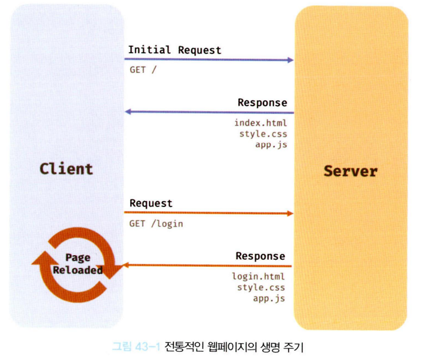

이러한 전통 방식은 다음과 같은 단점이 있다

1. 이전 웹과 차이가 없는 부분까지 포함된 전체 HTML을 받기에 불필요한 데이터 통신
2. 처음부터 랜더링되기에 깜빡임 발생
3. 서버와의 통신이 동기 방식으로 작동하기에 응답 이전까지 다른 요청이 블로킹된다.

`Ajax` 의 등장은 이전의 전통적인 패러다임을 획기적으로 전환했다.

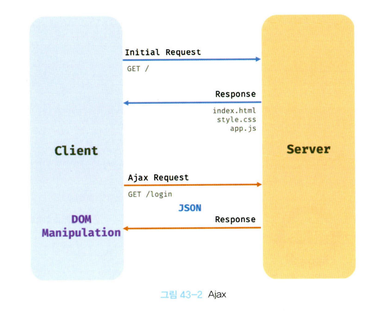
Ajax는 전통적인 방식과 비교했을 때 다음과 같은 장점이 있다.

1. 변경할 부분을 갱신하는 데 필요한 데이터만 서버로부터 전송받기 때문에 불필요한 데이터 통신이 발생하지 않는다.
2. 변경할 필요가 없는 부분은 다시 렌더링하지 않는다. 따라서 화면이 순간적으로 깜박이는 현상이 발생하지 않는다.
3. 클라이언트와 서버와의 통신이 비동기 방식으로 동작하기 때문에 서버에게 요청을 보낸 이후 블로킹이 발생하지 않는다.

## 43.2 JSON

`JSON(JavaScript Object Notation)`은 클라이언트와 서버 간의 HTTP 통신을 위한 텍스트 데이터 포맷이다. 자바스크립
트에 종속되지 않는 언어 독립형 데이터 포맷으로, 대부분의 프로그래밍 언어에서 사용할 수 있다.

### 43.2.1 JSON 표기 방식

JSON은 자바스크립트의 객체 리터럴과 유사하게 키와 값으로 구성된 순수한 텍스트다.
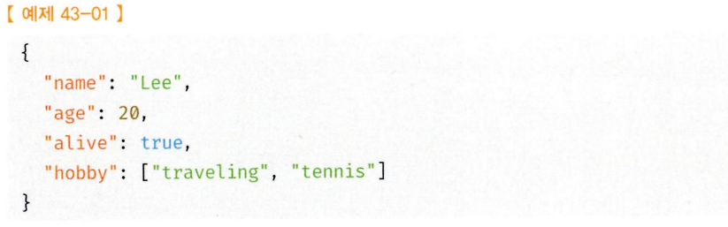
키는 반드시 큰 따옴표, 값은 리터럴 값 그대로를 사용하지만 문자열은 반드시 큰 따옴표를 써야한다.

### 43.2.2 JSON.stringify

`JSON.stringify` 메서드는 객체를 `JSON` 포맷의 문자열로 변환한다. 클라이언트가 서버로 객체를 전송하려
면 객체를 문자열화해야 하는데 이를 직렬화serializing라 한다.
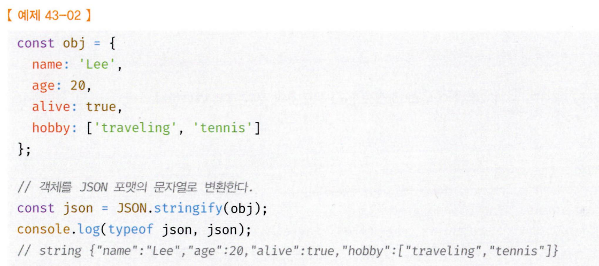

### 43.2.3 JSON.parse

`JSON.parse` 메서드는 `JSON` 포맷의 문자열을 객체로 변환한다. 서버로부터 클라이언트에게 전송된 `JSON` 데
이터는 문자열이다. 이 문자열을 객체로서 사용하려면 JSON 포맷의 문자열을 객체화해야 하는데 이를 역직
렬화deserializing라 한다.
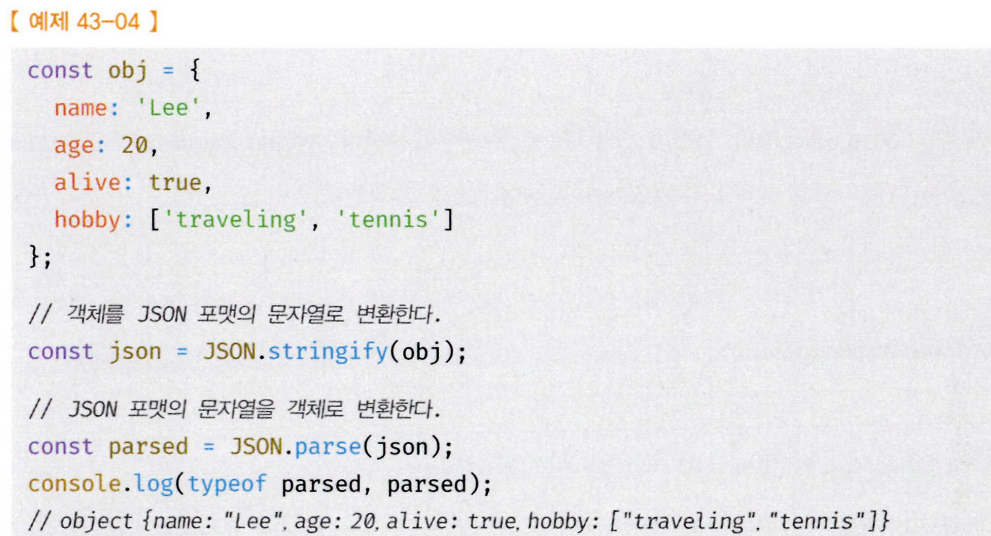

### 43.3 XMLHttpRequest

브라우저는 주소창이나 HTML의 form 태그 또는 a 태그를 통해 HTTP 요청 전송 기능을 기본 제공한다. 자바스크립트를 사용하여 HTTP 요청을 전송하려면 XMLHttpRequest 객체를 사용한다. Web API인
XMLHttpRequest 객체는 HTTP 요청 전송과 HTTP 응답 수신을 위한 다양한 메서드와 프로퍼티를 제공한다.

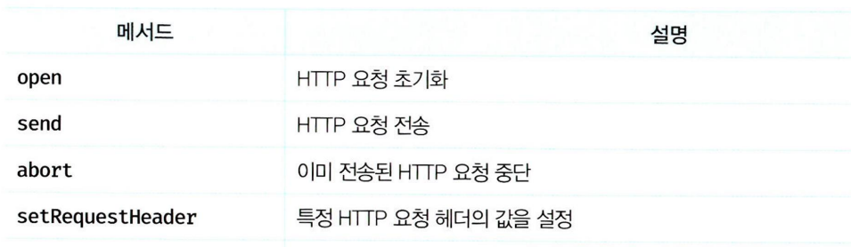
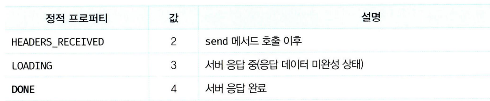

### XML 요청 보내기

```ts
//1. XMLHttpRequest 객체 생성
const xhr = new XMLHttpRequest();

xhr.open('POST', '/users');
// HTTP 요청 헤더 설정
// 클라이언트가 서버로 전송할 데이터의 MIME 타입 지정: json
xhr.setRequestHeader('content-type', 'application/json');
// HTTP 요청 전송
xhr.send(JSON.stringify({ id: 1, content: 'HTML', completed: false }));
//HTTP 요청 메서드가 GET인 경우 send 메서드에 페이로드로 전달한 인수는 무시되고 요청 몸체는 null로 설정된다.
```

`xhr.open(method, url[, async])`
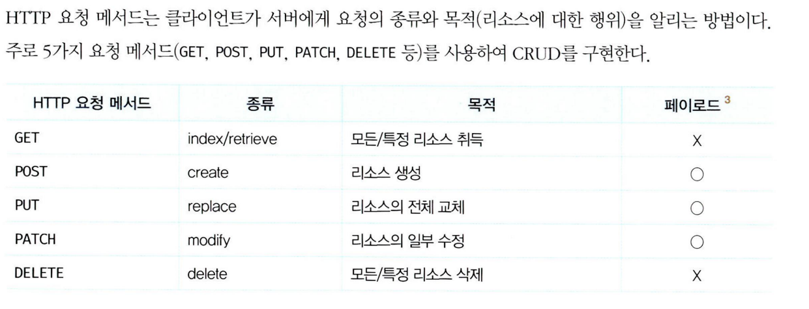

### 43.3.4 HTTP 응답 처리

XMLHttpRequest 객체는 브라우저에서 제공하는 Web API이므로 다음 예제는 반드시 브라우저 환경에서 실행해야 한다.

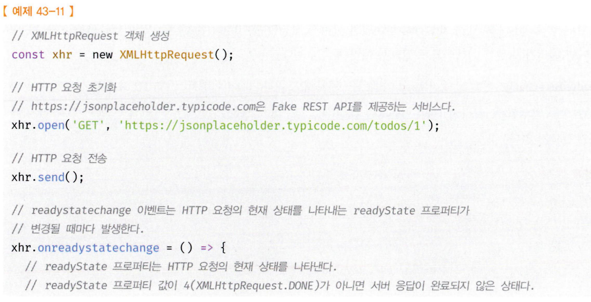
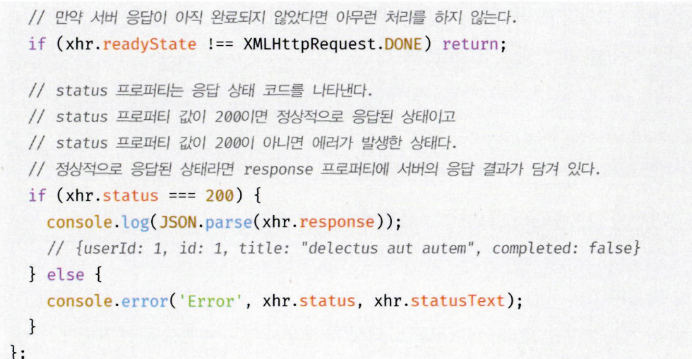

언제 응답이 클라이언트에 도달할지는 알 수 없다. 따라서 `readystatechange` 이벤트를 통해 HTTP 요청의 현재 상태를 확인해야한다.

readystatechange 이벤트 대신 load 이벤트를 캐치해도 좋다. load 이벤트는 HTTP 요청이 성공적으로 완
료된 경우 발생한다.

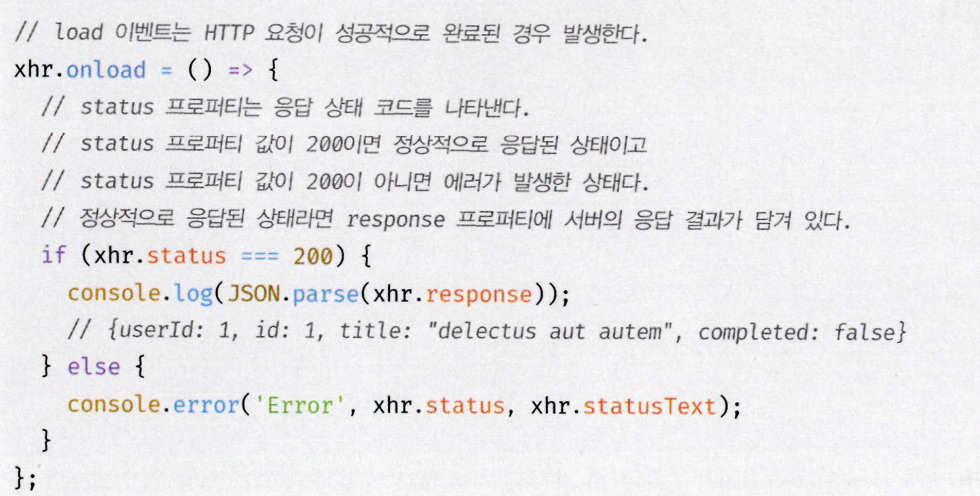
